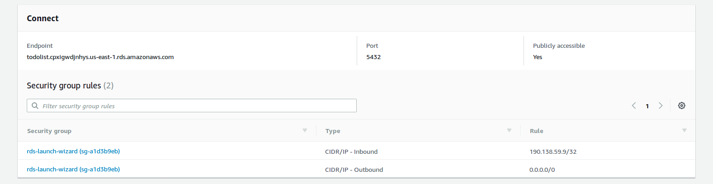
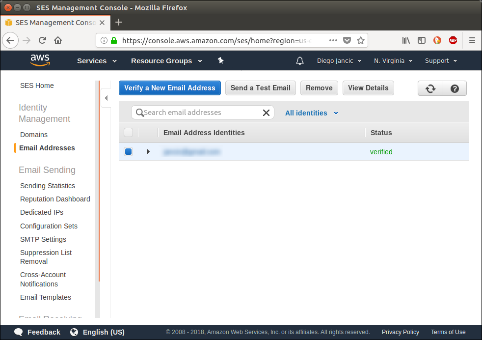
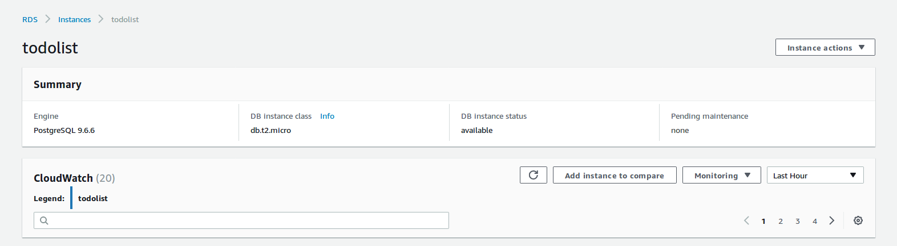

# Chapter 9: Understanding Function Performance

As we have seen up to now, there are different frameworks we can use to develop and deploy a web application to AWS Lambda. Some require more manual work to bundle the dependencies than others, but they also allow more fine-grained package building.

In this chapter we'll dive deep into how the different frameworks and the different factors affect the performance of our applications. When the browser issues an HTTP request, there are several steps performed internally until our application's code begins to execute. Starting with the browser connecting at a TCP level with the DNS server to resolve the domain name, it takes some time before our code starts running. We'll explore this whole process in depth.

The time it takes for the function to execute is only part of what it takes for the entire request to complete, but it is necessary to understand how long each part of a request takes to put everything in context. Let's start exploring what happens when a page is opened in the browser.

All the results from the performance tests, including the code used for each function, are available at [https://github.com/diegojancic/serverless-performance](https://github.com/diegojancic/serverless-performance). Since AWS and the maintainers from each framework perform improvements all the time, make sure to check that site to read the latest results that could potentially change one of the conclusions we reach here.

## The HTTPS Request

We have already done an introduction to the process in Chapter 6, but we need to put this in context. By timing and comparing each step in the request, it's possible to achieve better conclusions and focus on what matters the most.

The request starts when the user enters the URL in the browser address bar. There are a few things the browser does internally before the request actually starts, such as queueing low priority requests, allocating disk space for cache, or negotiating the connection with a proxy. The time spent on those depends mostly on the client's computer and network.

Once the request starts, there are three major things that need to get done before sending the request itself. First, the DNS resolution takes place to translate the domain name to an actual IP address where the connection can be made. Second, the TCP connection is done; and third, the SSL/TLS initial handshake needs to be done. All those steps need to be done only once in a while and not on every request. For example, the DNS resolution is usually cached at different levels and the SSL/TLS handshake is performed only on the first request.

When the HTTPS connection has been established, the request is sent, the server processes it, and sends the response. The following latency graph shows the processing time as "Wait", since the client is waiting for the server to respond.



The fastest response is, not surprisingly, from Virginia (US). The reason for this is that the Lambda function was hosted in the us-east-1 AWS datacenter, which is located in Northern Virginia. The geographical proximity makes the requests faster.

If we zoom in on the Virginia results, the results are as follows:

DNS resolution: <1ms; TCP connection: 16ms; TLS handshake: 3ms; Waiting: 39ms; Total time: 58ms.

If you are not one of the ~8.5M people who live in Virginia, the page will take (much) longer to load.

From the base 58ms that it takes to load from the same region, we can see that the same request from other locations within the US or Europe take an additional extra 300ms on average. If the request is from one of the other regions, it would take an extra 720ms on average instead.

Now, it's also possible to deploy the same Lambda in multiple regions if we want to reduce latency. Doing so requires uploading our functions to the regions we want and then creating API Gateway endpoints for each of those. Then, in Route 53 we need to create Latency-based records to point to the correct endpoint. Route 53 keeps latency information between regions and when a client tries to resolve the domain name, the DNS server responds with the address of the fastest endpoint based on the client's estimated location. Because latency can change over time, one client could be redirected to one region this week and to another region the next one.

For a trivial test using latency-based routing, it's easy to see and evaluate the results:


The latency times shown in the last graph correspond to a Lambda function that was deployed in 3 datacenters, one in California, one in Virginia, and one in Tokyo. The response time from within Japan is incredibly fast but also locations nearby benefit from it. For example, connections from Seoul (South Korea) and Singapore dropped from 850ms to 200ms on average.

There's one catch though: those Lambdas don't do anything useful other than returning a static response! A real-world application will likely connect to a database or to other resources that are harder to distribute globally. Caching information in memory might help, but that's not always possible. With the proper considerations, the speed gain in this scenario can be important.

| Summary Response Times by Geo Location |  |
| :--- | ---: |
| Lambda billed time  | 2ms |
| Request from same region [baseline] | 80ms |
| Request from US/Europe | [baseline] + 120ms |
| Request from other locations | [baseline] + 225ms |

## Benchmarking Against EC2

How does Lambda compare to a regular EC2 server? Comparing the response times might be tricky as the features of an EC2 instance are not the same as a serverless hosted application. Nevertheless, I wanted to see what's the cost in time of Lambda.

Lambda+APIG responded in 23ms on average, while a simple Linux instance using the Apache web server on EC2 returned in 1ms on average. If we add CloudFront on top of that to support HTTPS for example, we get another 7ms on average, for a total of 8ms for the EC2+CloudFront combination.

On the other side, out of the 23ms that Lambda+APIG took to respond, 3ms were spent on API Gateway exclusively and 20ms were spent in the connection between APIG and Lambda.

In most cases, <30ms of average added latency will not be noticeable. If time is critical for your application as it can be with some fintech sites, then you have reason to stick to an EC2 server.

## Lambda Execution Lifecycle

Once the request reaches our Lambda, its execution begins. Before the first line in our code gets actually executed, there's an initialization phase usually known as "cold start". During the cold start, the Lambda service downloads the code, starts a new container where the code will actually run, and bootstraps the runtime. If the Lambda is configured to work inside a VPC—that means, a private network within your AWS account—then it also has to create the network interface and attach it to the network.

All this process was beautifully explained in the AWS re:Invent 2017 conference by Ajay Nair, Principal Product Manager for AWS Serverless Applications, which can be watched online. This is how the process looks on a timeline:



The time taken to download the code (and uncompress it) logically increases as the function size increases. While this will surely change over time and from region to region, tests have shown it takes 100ms for every 8MB of function size, or 12ms for each extra MB in the function size. Starting a container and performing the runtime initialization takes between 250 and 300ms in the same tests.

It might take several hours until a function instance gets disposed, so a few hundred more milliseconds might not be noticeable once in a while. But that would be in an ideal world with a static traffic pattern. Real-world applications are more likely to have peaks in traffic and during those peaks, it's more likely to have concurrent requests. When that happens, another instance of the function will be launched and the client will have to wait for the cold start period before getting a response. Amazon's recommendation is to reduce the cold start time as much as possible and learn to live with them.

Attaching to a VPC is necessary to access other resources in the account. A Lambda function connecting to a database server in a private network must connect to it first. That requirement cannot be avoided in most cases and has an important performance penalty of between 500ms and 10 seconds. This delay fortunately applies only during the initial start; when the container is reused, there's no difference in execution time.

| Summary Cold Start Times |  |
| :--- | ---: |
| Average [baseline] | 280ms |
| Extra package MB | [baseline] + 13ms * (pkg size) |
| Using VPC | [baseline] + (500ms - 10s) |

## Framework Comparison

After reading 3 chapters of different frameworks, the first thing I ask myself is: which one is faster? While that question is not fair as the different frameworks offer different features, let's see some benchmarks.

If the container is reused, there's little difference between one option or the other. All results were under 5ms on average in those cases. The initialization time had more significant differences:

| Summary Framework Times - Container First Run |  |
| :--- | ---: |
| Chalice | 0ms |
| SF + Flask | 35ms |
| SF + Django | 80ms |
| Zappa + Flask | 750ms |
| Zappa + Django | 2,270ms |

However, we are comparing apples to oranges here. Chalice is a small routing library that is already installed in Lambda, which means it doesn't have to be packaged and uploaded along with the function's code. Flask is a WSGI framework that has only the basic features and includes no template engine, no ORM, no nothing. Django includes all of that. The differences can then be seen because those examples are trivial. The more libraries we add to our Flask application, the more it will end up looking like a Django one.

The difference between Zappa and the Serverless Framework is noticeable though. While Zappa does a better job packaging the required dependencies, its start time is not justified in my opinion.

## Digging Deeper with X-Ray

X-Ray is a great service for debugging performance issues on AWS. It collects and processes traces submitted by other AWS services such as Lambda, RDS, DynamoDB as well as custom traces that are sent by the application code.

The easiest way to get started is by going to the Lambda we want to monitor and enabling the checkbox "Enable active tracing". Also, you can enable X-Ray in API Gateway to get the full picture. With that enabled, X-Ray will start recording the traces for each request. A simple trace will show the time spent in APIG, Lambda, and our code itself:



The funnel-type view shows that it took 40ms to execute the request, 17ms of which were spent on the Lambda code specifically, while the rest was the overhead spent in either APIG or the Lambda infrastructure.

To perform intra-code timings, the X-Ray SDK can time and tag segments. Install the aws-xray-sdk package using pip and then set it up:

```python
# Import required library
from aws_xray_sdk.core import xray_recorder

# Configure
xray_recorder.configure(service='App Name')
```

Because the Lambda call is already traced and sent to the X-Ray service, sub-segments can be created and annotated. A subsegment is a portion of code that's going to be timed. The subsegment then can be annotated with key-value pairs, which are indexed by X-Ray and can be used to filter the traces later in the X-Ray console. Setting metadata is also possible, which can be more complex in structure although not searchable.

We use annotations to tag and filter traces and metadata to provide additional information or context once we dig more into a specific trace. With the xray_recorder setup and the segments being created automatically by the Lambda service, the subsegments are created with a few lines:

```python
@app.route('/api/get-user')
def get_user():
    segment = xray_recorder.begin_subsegment('get-user')
    segment.put_annotation('AppVersion', "1.1")
    segment.put_annotation('UserLocation', get_user_loc())
    segment.put_metadata('Permissions', get_user_perms())
    
    # Do the actual work
    response = get_user_response()
    xray_recorder.end_subsegment()
    return response
```

That's a simple Flask function being traced with X-Ray, batteries included. First, the subsegment is created with begin_subsegment; the argument is just the name of the subsegment and could be anything.

The put_annotation is then used to tag that specific trace. Key and Value are being passed. X-Ray will index up to 50 annotations that can be used to search traces. The put_metadata is similar but receives 3 parameters: the first is the Key of metadata to be added, the second is any object that can be JSON serialized, such as a simple value, a dictionary, or simple objects. The third parameter, optional, is the namespace for that metadata.

When exploring the trace, the annotations will be displayed in a simple 2-column table: Key, Value. The metadata, instead, will be displayed as a JSON object, where the top-level properties are the namespaces (or 'default'), then each key and then the value. For example:

```json
{
  "namespace": {
    "key": {
        // JSON-serialized object
    }
  }
}
```

X-Ray can be configured to record only a sample of the requests to avoid paying for all traces. While it is subject to change, the first 100 thousand traces per month are free, which should be more than enough to get a good and statistically significant sample.

## Zappa's Slim Handler and Memory Usage

One of the cool Zappa features that we haven't explored yet is the ability to deploy large projects seamlessly. AWS Lambda comes with a package size limit of 50MB, which means that the code and the dependencies packaged in a single zip file cannot be more than that.

This limitation works as a hint and reminds us '*hey, watch out for the application size!*'. As the application becomes larger, Lambda takes longer to download the code and initialize the container. If the dependencies take a lot of space, then it might be needed to rethink the application architecture and move certain parts to another Lambda function to keep everything fast.

Developers do not like limitations clearly and the Zappa team figured a way to overcome this. By enabling the slim_handler option in the Zappa settings file, Zappa will build and deploy 2 different packages: one will be a small static handler used as the Lambda function code, and the second one will contain the application code itself and be uploaded to S3. When the function gets executed the first time, the application code is downloaded during runtime (not during the cold-start period handled by AWS) and put on the local hard drive; then, the actual function code gets executed.

This is clearly not a free pass as it has some performance implications. To make the comparison fair, imagine our application is 49MB in size and is deployed with and without the slim handler. The application using it will have a shorter cold start period as, instead of downloading a ~49MB package, it will be downloading one that's around 10MB. However, as soon as the function starts executing, it will download the code from S3 and decompress it. That takes a long time: around 5 seconds based on experiments.

As if that wasn't enough of a problem already, there's another downside of using the slim_handler option—memory. A simple Flask application doing something trivial will consume almost 50MB of memory; if we enable the slim handler, another 120MB of memory are used, for a total of about 170MB. That extra memory adds 2 totally new problems to the table: first, there is less memory available for the application itself and second, the Lambda containers are likely to recycle more often. AWS has stated that the more memory a Lambda function uses, the more likely they are to recycle it often. The reason is that memory is expensive and, to save resources, they recycle the functions with high memory utilization. Recycling more often means more cold starts and more delays. Something we want to avoid as much as possible.

The moral of these slim-handler tests is not that we should never use it. Slim handlers are useful for certain types of applications. Processing batch files, running Machine Learning, or connecting to external services on a periodic basis are all processes that normally can wait a few seconds and can be deployed with the slim handler enabled.

On the other hand, regardless of whether we use the slim handler or not, memory consumption can lead to performance problems and more cold starts. Once the container was initialized, the function with or without the slim handler performs similarly time-wise.

## Wrap-Up

There's no one-size-fits-all framework when we put everything on the scale. Chalice is clearly the winner in terms of performance, but we would have vendor lock-in. The Serverless Framework provides good performance as well and Zappa gets decent results if used carefully. For quick projects, easy setup and deployment, Zappa is the clear winner as it seems to deal with dependencies better than others.

For Python frameworks, it's no surprise that Flask is faster than Django, but that's only because Flask needs a lot of add-ons to do the same thing that Django does. For large projects built using a traditional architecture (as opposed to a microservice one), Django might be an easier way to start and lead to similar results at the end.

In any case, watch out for package size and memory consumption. While that's not specific to serverless applications, it's especially important in those. Optimize to have short cold starts by keeping the package sizes low, placing the Lambda in a VPC only if necessary, and delaying the execution of initialization code as much as possible.

---

[← Previous: Chapter 8 - Chalice](08-chalice.md) | [Next: Appendix A - Running Docker in Production →](appendix-a-docker-production.md)