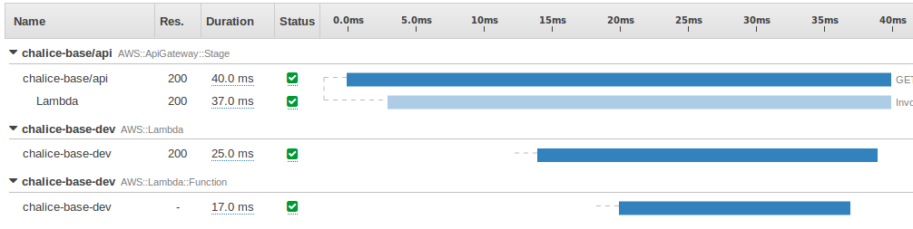
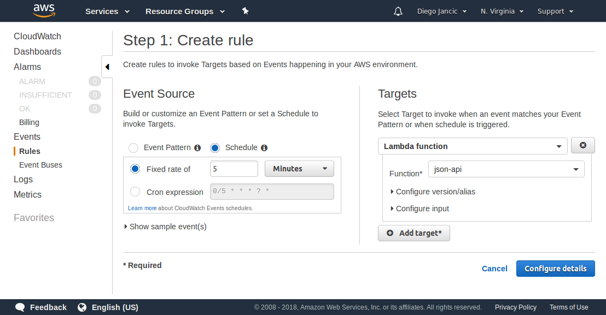

# Chapter 2: Web Development Essentials

Python is an incredible language. Because of its extensive use in academia, it's possible to find very useful open-source and free libraries. To perform advanced linear algebra and calculations, Numpy and Pandas provide a very easy-to-use API and incredibly fast performance. Machine learning algorithms are available in SciPy and TensorFlow for example, the latter being developed by Google itself. It's also possible to do some image recognition using libraries like OpenCV.

We have started with the most complex libraries though. Those are very powerful libraries that you might find useful someday, so it is worth knowing they are there. Python has hundreds of other more basic libraries aimed at solving day-to-day issues, such as parsing JSON or XML, accessing databases, etc. We will be using some of them when we need them.

On the other hand, if you ever heard something about Python, you probably heard that it is slow. Its speed is one of the most common concerns, and it is indeed true that Python is not very fast compared to other languages. The libraries that make heavy use of the CPU to perform complex calculations are usually implemented in Cython or in C. Cython is a language similar to Python but strongly typed that allows you to write programs with a syntax similar to Python, but that execute at speeds closer to what a C program would do.

Because of that, it's not recommended to use Python to develop CPU-intensive algorithms, but to put together different parts of the system. In most cases, a slow website is the result of either a poor design decision, a problem in the database design, or the delivery of the content to the user's browser. The time spent processing the code itself is, in most cases, small compared to the other tasks. There are important sites out there using Django, Instagram being one of them and serving more than 800 million active users per month, so we believe its speed is not a deal-breaker for most sites.

If you have used Python and Django in the past, feel free to skip this chapter.

## Python

We are going to start with the basics of the language. This is not intended to be a full guide on Python, but to quickly get you up to speed on basics of the language if you are coming from a different language. We will be using Python 3.6 for all the examples here, and we assume you have installed that already.

Let's start with a simple "hello world" example. We create a file called `hello-world.py` and then run it by executing `python hello-world.py`. Here's the content of our file:

**hello-world.py**
```python
print("Hello World")
```

Output:
```
> python hello-world.py
Hello World
```

Let's go a bit faster and do a quick syntax overview with some examples. Code blocks need to be indented, instead of using a special keyword or brackets as other languages do. Python uses indentation (either spaces or tabs, but not both) to separate code blocks.

### Syntax Overview

Let's see a full example with comments in the file:

**syntax-overview.py**
```python
# Everything after the # symbol is a comment
"""
Block comments in Python are between 3 double-quotes.
"""

# define a variable and assign zero to it
a = 0

# function
def say_hello():
    return "Saying Hello"

# call the function and print the result
print(say_hello())

# function with parameters
def do_sum(a, b):
    return a + b

print("a+b = {}".format(do_sum(5, 3)))

# if and comparers
a = 5
b = 10
if a == b:
    print("a equals b")    # will not be executed
elif a < b:
    print("a less than b")    # will be executed
else:
    print("a >= b")    # will not be executed

# FOR iterator
# 'i' will hold the current values
# Range function expects 3 params: start, stop and optionally step
for i in range(0, 10, 2):
    # will print 0, 2, 4, 6, 8
    print(i, end=",")
```

One note is needed before we execute that file to see the output. Python accepts both positional and named arguments. Positional arguments always have to go before the named ones, so if we have a function defined as:

```python
def func(a, b, c, d=0, e=0):
    pass
```

That means that the function is called 'func' and that it has 5 arguments. The first 3 arguments are mandatory as there's no default (i.e., no equals sign after the name of the argument). To call that function we need to write `func(1, 2, 3)`, which will call the function with 'a' being '1', 'b' being '2', and 'c' being '3'. It's also possible to specify the other 2 arguments, d and e, either by position or by name. For example: `func(1, 2, 3, e=5)`.

Going back to our example, the call to the print function at the end passes a named argument called 'end'. The default value for that parameter is a new line, but we replaced it in this case with a comma.

If we execute that file we get:

```
> python syntax-overview.py
Saying Hello
a+b = 8
a less than b
0,2,4,6,8,
```

### Classes and Objects

We also can create classes and objects:

**classes.py**
```python
class User(object):
    def __init__(self, name):
        self._name = name
    
    def show_name(self):
        print("My name is: {}".format(self._name))

user = User(name="John")
user.show_name()
```

By convention, private fields start with an underscore, such as `_name`. The first argument in both functions, 'self', is a pointer to the current object; the same 'this' would mean in C++, C#, or Java. The first function, `__init__`, is the constructor of the class. It gets called every time a new object is allocated in memory.

Below the class definition, a new 'User' object is created with name being 'John', and then the name is printed to the console. The output of that program would be *My name is: John*.

### Dictionaries, Tuples and Lists

Dictionaries in Python are very useful. We will see later that they are used for configuring our web framework, for example, or to get information from the web request.

**dictionaries.py**
```python
options = {
    'Database': '127.0.0.1',
    'Cache': True,
    'CachePeriod': 15
}

print("Database: " + options["Database"])
if options["Cache"]:
    print("Cached for {} minutes.".format(options["CachePeriod"]))

print("Cache server: {}".format(options.get("CacheServer", "Redis")))
```

In this example, we define a dictionary called 'options' with 3 keys. Then, we print the outputs, but you might have noticed that there are two ways to get a value from the dictionary. The first one is using a C-style syntax, like `options["key"]`. If the key is not present then an error is raised, that's why we can also call the 'get' method and optionally pass a second argument which indicates the default, as follows: `options.get("key", default)`. If the default value is not specified, it returns *None*.

Here's the output of that file:

```
> python dictionaries.py
Database: 127.0.0.1
Cached for 15 minutes.
Cache server: Redis
```

Tuples are next. A tuple is a sequence of items that cannot be changed. Because of that, we know it will not be accidentally changed, and they will also perform slightly faster than a regular, mutable, list.

For example, a tuple can be used to define the languages in Django:

**tuples.py**
```python
LANGUAGES = (
    ('en', 'English'),
    ('es', 'Spanish'),
)

print("First language code: " + LANGUAGES[0][0])
print("Second language name: " + LANGUAGES[1][1])
```

```
> python tuples.py
First language code: en
Second language name: Spanish
```

Another good thing about tuples is that their items can be of different types; you can mix numbers, classes, and strings in the same tuple. If we try to modify a tuple, however, we'll get an error:

```
Traceback (most recent call last):
  File "<stdin>", line 1, in <module>
TypeError: 'tuple' object does not support item assignment
```

This is when *lists* come into place. Lists can contain objects of different types in them; a list is simply defined between square brackets instead of regular parenthesis. For example:

```python
list = [3.14, 2, 3, ["hello", "python"]]
```

To access the list items, we can use the square brackets the same way we did with the tuples. `list[0]` will return the first item, which is 3.14. The last item is another list, containing the 2 strings.

We can also use the append method to add items or the del keyword to remove them. There are lots of things we can do with lists; we can get a range of items or get items counting backwards, but for now we are fine if we understand the syntax.

## The PIP Package Manager

A package manager is a tool that lets us install libraries we can use in our code. One of the most common package managers is *pip*, although there are others that are very common. For example, Conda is another multi-language, multi-platform package manager very used in the scientific community. If you want to get started with machine learning, Conda would be your best bet.

What's the difference you may ask? Each package manager supports its own type of packages. Pip is Python-specific and supports a format called wheel for pre-compiled packages for example, while Conda or Buildout also support non-Python packages. So, depending on what you want to do, one package manager or the other might be the most appropriate.

Since pip is the most used package manager for web development, we will be using this one in the rest of the book. A note before we start: using *pip* without a *virtual environment* is not really recommended as it can create conflicts between different projects; if you can, wait to read the next chapter on virtual environments before you start installing packages with *pip*.

### Installing

Once pip is installed, you can install packages by executing the following command: `pip install <package>`. To uninstall a package, just execute `pip uninstall <package>`.

If you are on Linux or Mac, you might need to add sudo before the command. If on Windows, you might need to run the cmd as Administrator for that to work. For example, if we want to read json, we can install the *simplejson* package as follows:

```
> pip install simplejson
Collecting simplejson
  Downloading simplejson-3.11.1-cp36-cp36m-win_amd64.whl (68kB)
    100% |################################| 71kB 425kB/s
Installing collected packages: simplejson
Successfully installed simplejson-3.11.1
```

That command downloaded the package from the PyPI archive and installed it. As you can see in the output, a file with extension .whl was downloaded. That file is the *wheel* archive, which is the format used to bundle all the binaries and sources of a package together. The whl file is nothing other than a ZIP file with a specific file structure, where all the metadata and Python files are stored.

It's also possible to install the package offline if we have the file. We just need to execute `pip install path/to/file.whl` to install the package directly from the file system. This is usually not required, but sometimes it might be useful for certain packages that are not available in the online directory, for example.

### Listing Installed Packages

Once we have installed all we need, we can create a list of the packages we are using. Executing `pip freeze` will list not only the packages, but also the versions we have installed. Furthermore, we can execute:

```
pip freeze > requirements.txt
```

to output the entire list of requirements into a file called requirements.txt. The output file will look something like this:

**requirements.txt**
```
simplejson==3.11.1
requests==2.13.0
...
```

That shows that we have installed the version 3.11.1 of 'simplejson', the version 2.13.0 of the 'requests' package, and so on.

If we later want to reinstall all the packages on a different computer, we just need to execute:

```
pip install -r requirements.txt
```

to install all the packages listed in our file.

## Django

There are several web frameworks out there that you can use. Django is a very popular one, but you also can use Flask, Tornado, or web2py. Flask is a very lightweight framework with nothing on it, which might be a good option if you want to learn Python or do everything your own way. Tornado was developed initially by FriendFeed; it provides fast, non-blocking connections, ideal to handle real-time updates for thousands of users at the same time. Web2py, instead, is an all-in-one framework that has everything included, ideal for simple projects.

Django is something in between those other projects. It gives us a basic setup, a good project structure to start, and a simple, yet powerful, administrative backend that can be used to view and modify our data. One of the great advantages of Django is its community—not only the amazing support you can get online, but also the amount of packages available. It's not rare to find a project that does what we are trying to do in Django. If you are coming from a different language, such as .NET or Node.js, I would recommend searching online for what you are trying to do before you start coding; it might already be done by someone else!

### Our First Project

Creating the first project is pretty straightforward. First, you need to install Django, and for installing a package we know we have pip. To do so, we install it as follows:

```
pip install django==1.11.5
```

We have specified the version by adding `==1.11.5` to make sure we all work with the same version of Django. Once Django is installed, that creates a utility called django-admin, which we will use to perform some general administrative tasks in our Django project. We can use the django-admin to migrate the database, run our unit tests, launch a shell in our project, and more. Before we can do all that, however, we have to create our project first.

```
django-admin startproject website
```

That simple command will create a new project in a folder called *website*. The file structure of our project now should look like this:

```
website/
  - manage.py
  - website/
    - __init__.py
    - settings.py
    - urls.py
    - wsgi.py
```

Our *manage.py* file does the same as our django-admin tool, but it already takes care of loading the correct setting files, so we will be using this one instead. To launch our website using the development web server, we just need to execute the *runserver* command. Before we do that, let's create our database and an administrator account on it.

To create the database, execute:

```
> python manage.py migrate
Operations to perform:
  Apply all migrations: admin, auth, contenttypes, sessions
Running migrations:
  Applying contenttypes.0001_initial... OK
  Applying auth.0001_initial... OK
  Applying admin.0001_initial... OK
  Applying admin.0002_logentry_remove_auto_add... OK
  Applying contenttypes.0002_remove_content_type_name... OK
  Applying auth.0002_alter_permission_name_max_length... OK
  Applying auth.0003_alter_user_email_max_length... OK
  Applying auth.0004_alter_user_username_opts... OK
  Applying auth.0005_alter_user_last_login_null... OK
  Applying auth.0006_require_contenttypes_0002... OK
  Applying auth.0007_alter_validators_add_error_messages... OK
  Applying auth.0008_alter_user_username_max_length... OK
  Applying sessions.0001_initial... OK
```

The *migrate* command executed all the scripts in our database. The database is configured in the *settings.py* file, and by default it uses SQLite. After running that command, you will notice that a file called '*db.sqlite3*' was created in the root directory of our project. We will explore a little bit more of this command after we create our own model.

You can execute the *help* command at any time to see the list of available commands; just execute `python manage.py help`. Our next step is to create an admin account, which is as easy as executing the createsuperuser command in manage.py:

```
> python manage.py createsuperuser
Username (leave blank to use 'diego'): 
Email address: diego@example.com
Password: 
Password (again): 
Superuser created successfully.
```

Now we are able to run our website for the first time!

```
> python manage.py runserver
Performing system checks...

System check identified no issues (0 silenced).
October 20, 2017 - 19:42:48
Django version 1.11.5, using settings 'website.settings'
Starting development server at http://127.0.0.1:8000/
Quit the server with CTRL-BREAK.
```

That launched a web server that is waiting for requests. From the same machine, we can navigate to http://127.0.0.1:8000/ in a web browser and see the default welcome page. Furthermore, we can navigate to [http://127.0.0.1:8000/admin](http://127.0.0.1:8000/admin) and login with the user we just created. That will give us access to a page where we can edit users and groups in our website. As we add more features to our application, that admin interface is going to become more useful.

This is how the admin interface looks like:



### Creating an App

So far we have only used the built-in functionality of Django. Let's create our first app. Since exploring Django could take an entire book, we are only going to go through the basics. We are going to create a simple to-do app. It's not the most exciting app, but it will help us go through the basic CRUD operations as quickly as possible.

To create our new app, we need to execute:

```
python manage.py startapp todo
```

'*startapp*' is the command we use to create a new application for Django, while *'todo'* is the name of the application. That will create a folder with the name of the app (i.e., *todo*) in the same directory where the manage.py file is located. Inside, the following files are created:

```
website/
  - manage.py
  - website/*
  - todo/
    - migrations/
      - __init__.py
    - __init__.py
    - admin.py
    - apps.py
    - models.py
    - tests.py
    - views.py
```

Django uses an MVC-style architecture, which is very helpful to keep everything organized. While it's not absolutely necessary to use this file structure we are going to use, it's very useful to follow the convention as it makes it easier to understand for other developers.

The MVC pattern means that we will need to write our Model in one place, our View in another place, and then Controller in a third place. Django confuses a little bit the names since the views are called templates and the controllers are called views. It really depends on whether you call view to *what* data is displayed, or *how* the data is displayed. It's a very subtle distinction but, in Django terms, we will need to create a model to define how our data is structured, a view that decides what data is displayed, and finally a template that defines exactly how our data is shown.

Before we can use our app, we need to register it with Django. In our project settings (that's in the file website/settings.py), we have an array called INSTALLED_APPS that lists the apps that Django has to load. We edit that file to add our new app:

**website/settings.py**
```python
...
# Application definition
INSTALLED_APPS = [
    'django.contrib.admin',
    'django.contrib.auth',
    'django.contrib.contenttypes',
    'django.contrib.sessions',
    'django.contrib.messages',
    'django.contrib.staticfiles',
    'todo'
]
...
```

We added 'todo' at the end of the application list, so Django can find it and load it in the project.

Now let's start with the model. We edit our models.py and create a simple to-do class:

**models.py**
```python
from django.db import models

class ToDoItem(models.Model):
    text = models.CharField(max_length=100)
    created_on = models.DateTimeField(auto_now_add=True)
    completed = models.BooleanField()
    
    def __str__(self):
        return self.text
```

We have created a class called ToDoItem with 3 properties. In the first line we are importing the django.db.models package that helps us define the classes in our model and also how they map to our database. In other languages and frameworks, the model definition is separated from how it maps its fields to the database, but Django puts it all together, which makes it very handy.

The first property in our model is 'text' and it's a string with a maximum of 100 characters. Created_on is a date and time field and the auto_now_add is set to True, which means Django automatically sets the field to the current time when inserting a new entity in the database. The third field is boolean with everything set to its defaults.

The next step is to create the views. We are going to create 4 views: one to list all the items, one to create a new item, one to delete an item, and one to update an item. There are a few different ways to create views in Django; we can do it manually using a function that renders the content, or we can use the new generic views. The generic views provide the most common use cases, such as CRUD operations. However, for the sake of learning a bit more about how this works and what the workflow is, we are going to use old-style views. This kind of view is basically a function that receives one parameter, the request, and returns an HttpResponse. The HttpResponse is an object with the content, headers, and response code of the response.

We open the views.py file that's located in our 'todo' folder and write our first view:

**views.py**
```python
from django.shortcuts import render
from todo.models import ToDoItem

def index(request):
    items = ToDoItem.objects.order_by('-created_on')
    context = {'items': items}
    return render(request, 'todo/index.html', context)
```

Let's see what that code is doing. First, we import a function called 'render' from the 'django.shortcuts' package. The 'render' function is a shortcut that renders a template and returns an HttpResponse with the content. Second, we import our class 'ToDoItem'. Our view is defined as we explained before; it's a function that receives a parameter with the request information. The name of the function and the parameter is not important; we just decided to call it index.

Because our class inherits from the django.db.models.Model class, we have a bunch of useful methods available. The first thing we do in our view then, when we receive a request, is get all the items from the database. To do so, we have a property called 'objects' in our class that allows us to perform database operations. In the first line of our function we are listing all the items stored in our database, sorted by the property 'created_on' in descending order as indicated by the minus sign before the property name. Next we create a context dictionary containing all the properties we want to be available when our HTML is rendered. Finally we make a call to the render shortcut specifying the request information, the path to our template (that we will be creating in a second), and our context variable that includes the information we need to render our response.

Now we need to create our template. We are going to add a small extra step to avoid repeating ourselves in the future. We are going to add our index.html file but also a file called base.html. That base file will contain the general HTML markup we are going to use in all the pages. The index file then is going to extend that base.html file and add only the view-specific HTML markup. Django looks for templates in a folder called 'templates' inside the installed apps. That means that we need to put our next two files (base.html and index.html) as follows:

```
website/
  - manage.py
  - website/*
  - todo/
    - migrations/*
    - templates/
      - todo/
        - base.html
        - index.html
    - ...
```

Note that the files are inside a folder called 'todo' which is inside the templates folder, which is also inside a folder called 'todo'. To recap, the top level 'todo' folder indicates that our app has that name. Then the template folder contains all our templates, but just to avoid conflict with templates in other apps (i.e., if two different apps have a template named index.html), we are going to place all our template files inside a folder with the same name as our app.

Now, let's create the basic markup for our base file:

**base.html**
```html
<!DOCTYPE HTML>
<html lang="en-US">
<head>
    <meta charset="UTF-8">
    <title>To do items</title>
</head>
<body>
    
</body>
</html>
```

That's all basic HTML markup, except for the only line inside the body tag. The `` tags in the content are Django-specific and are used to provide some kind of logic while the template is being rendered. It's the equivalent to `<?php ?>` in PHP or the `<% … %>` in ASP and ASP.NET.

Now that we have created a block called 'content' (that's the parameter after the keyword 'block' and it could be anything we would like), we can create another page that extends this base page.

**index.html**
```html



    <h1>To Do Items</h1>
    <ul>
    
        <li>{{ item.text }}</li>
    
        <li>No items in the list.</li>
    
    </ul>

```

Here's the template for our index page. In the first line we specify what other template it's extending. Note that the templates folder is not mentioned in the path; we just need to include whatever's after the templates folder in the path to our file.

To extend the block we have previously created in the base.html page, we use the exact same syntax, but this time we add our content in it. We are iterating the items with a simple for loop; we output the items' text using the `{{ … }}` tags. Then we handle the specific case for when the for-loop has no items using the `` tag, and then we close the loop with the endfor keyword.

Our first view is almost done: we must tell Django what URL we want to use to place that view. Django allows the use of a hierarchy system for defining the URLs, that means that we can either define all the URLs in the same file, but we also can define a sub-URL for each app and then delegate the URL definition to the app. For example, we can tell Django that all the URLs related to the 'todo' project are going to be located under /todo/ and then define the path to the other views inside our todo project.

To edit the root URLs, we need to edit the file urls.py located in the website folder, where the settings.py file is.

**website/urls.py**
```python
"""website URL Configuration

The `urlpatterns` list routes URLs to views. For more information please see:
    https://docs.djangoproject.com/en/1.11/topics/http/urls/
Examples:
Function views
    1. Add an import:  from my_app import views
    2. Add a URL to urlpatterns:  url(r'^$', views.home, name='home')
Class-based views
    1. Add an import:  from other_app.views import Home
    2. Add a URL to urlpatterns:  url(r'^$', Home.as_view(), name='home')
Including another URLconf
    1. Import the include() function: from django.conf.urls import url, include
    2. Add a URL to urlpatterns:  url(r'^blog/', include('blog.urls'))
"""
from django.conf.urls import url, include
from django.contrib import admin

urlpatterns = [
    url(r'^admin/', admin.site.urls),
    url(r'^', include('todo.urls'))
]
```

That urls.py file comes with a lot of comments on the top that we could have removed, but that exactly explains what we are doing. First we are following the steps described under the "Including another URLconf" part. Because we want our index view to be on the default page in our site, we are going to leave the path blank. By including the 'todo.urls' file we are delegating the assignment of the views to the sub-URLs to a file called urls.py in the 'todo' project.

Next, we need to define that file:

**todo/urls.py**
```python
from django.conf.urls import url
from todo.views import index

urlpatterns = [
    url(r'^$', index, name='list')
]
```

In this file we are finally assigning the root path to the index view. The path expression we are using, specified as `r'^$'`, is because it's a regular expression. The ^ symbol means the beginning of the path and the $ symbol means the end of the path, so it will basically match any path that's empty.

Launch the web server now to test the application. Remember, to launch it we need to execute:

```
python manage.py runserver
```

Once the server is ready, we can navigate to the root of our website. If we do that, we are going to see an error that, among other things, says "no such table: todo_todoitem". The problem is obviously that there's no table with such name in the database, and that's because we never created it. When we created the model, we told Django how to map it to the database, but we still need to create such table in our database. Fortunately, Django is able to manage all the changes in the database for us.

The framework stores all the schema changes in 2 different places: in .py files and in the database. The .py files are migration files that are placed inside the 'migrations' folder of each application, for example in /todo/migrations/. These files are named as NNNN_<name>.py where NNNN is an incremental number starting in 0001. Each of these files contains code that specifies what changes were made in the database, such as creating a new model, adding a new field, changing an index, etc.

The second place where Django stores the changes is the database. There's a table named django_migrations that contains the list of changes we have executed in the database. With such information, it's able to detect what changes are pending and execute them in the database.

Since we already created our model, we can run our first command, makemigrations, which will read our models and create the .py files that describe the changes performed in our models.

```
> python manage.py makemigrations
Migrations for 'todo':
  todo/migrations/0001_initial.py
    - Create model ToDoItem
```

The makemigrations command created our initial database migration script, called 0001_initial.py. That file contains a Python class that creates our table, the one we need to hold the to-do items.

We now have our migration file that tells Django what are the required changes in the database. The way to execute those files in the database is by running the migrate command as we did right after we created the project. The migrate command looks for differences between our migration files and what was executed already in the database (i.e., looking at the django_migrations table).

```
> python manage.py migrate
Operations to perform:
  Apply all migrations: admin, auth, contenttypes, sessions, todo
Running migrations:
  Applying todo.0001_initial... OK
```

Once we have run the migrations against our database, the page is going to work. Effectively, if we run the runserver command again, we will be able to see our site for the first time:



### Completing Our Application

We got our first application working on Django. It's not very fun yet as it doesn't do anything other than listing an empty database. So let's add the other views to create, update, and delete items from our list.

Let's first add the option to create new items. We need to create a view that receives the text and creates the item in the database. We can do that as follows:

**todo/views.py**
```python
from django.shortcuts import render, redirect

# ...other imports and 'index' view...

def create(request):
    item = ToDoItem(text=request.POST["text"])
    item.completed = False
    item.save()
    return redirect("todo:list")
```

In our new view, we are first creating a new instance of the class ToDoItem and passing the text field as an argument. In the request variable we have the dictionaries POST and GET that we can use to get the submitted information from the client. In this case, because we will be doing a POST from our form, we use that property to get the submitted text. Then we set the completed field because it's required and we haven't specified any defaults, and finally call the .save() method to persist our object in the database.

The last line of our function view is a return calling the redirect shortcut. In the index view we had called a shortcut called render that processed the template and returned an HttpResponse object containing the final HTML response and the headers that were going to be sent to the client. The redirect shortcut is similar, but it just returns an HTTP 302 response, which makes the client browser redirect to another page. The parameter passed to the redirect method is the name of the page we want to redirect to. Because we have specified 'todo' as a namespace in our main urls.py file, we need to enter the name of the URL in the format namespace:view_name. The 'list' name comes from our urls.py file, located in the todo application.

Now we need to add the new view to the URLs file and update our HTML file to allow posting new items:

**todo/urls.py**
```python
from django.conf.urls import url
from todo.views import index, create

urlpatterns = [
    url(r'^$', index, name='list'),
    url(r'^create$', create, name='create'),
]
```

Note that in the second line we had to add the import to our view and also add the URL, which we called 'create'. In our template, we need to add inside our content block:

**todo/templates/todo/index.html**
```html
...
<h2>Create Item</h2>
<form action="" method="POST">
  
  <label for="text">Item text: </label>
  <input type="text" name="text" id="text" />
  <button type="submit">Create</button>
</form>
...
```

There are several things worth explaining. First, we have a form that is going to do a POST on submit and it's going to do it to the 'create' page; we have used the `` tag to point at that URL. The advantage of using the URL tag is that if we later decide to change the location of that view, we don't need to update all the templates and views in the system. The framework takes care of re-routing all the links to the new URLs.

We have 3 elements inside that form: a label, an input, and a button. The name of the input is what the browsers send to the server when a form is submitted. That 'name=text' matches with the field we are expecting in our view, as defined above in the views.py file.

We also have added a tag ``. That's a hidden field generated and validated by Django that prevents CSRF attacks on our site. CSRF stands for Cross-Site Request Forgery and is a type of attack where another user attempts to send information to the site on behalf of a legitimate user. The token generated is some kind of pre-authorization we make to allow the user to send content to our site. Since our site is anonymous so far, it really doesn't add much value, but it's recommended to add it just in case we want to add users in the future.

Adding the update and delete view to complete our application is pretty much the same we did until now.

We need to create our views to receive the information from the web browser and update the database:

**todo/views.py**
```python
# ...other imports and 'index' view...

def delete(request):
    ToDoItem.objects.filter(pk=request.POST["id"]).delete()
    return redirect("todo:list")

def update(request):
    item = ToDoItem.objects.get(pk=request.POST["id"])
    item.completed = request.POST.get("completed") == 'on'
    item.text = request.POST["text"]
    item.save()
    return redirect("todo:list")
```

Then we need to register those 2 new views in our URLs file:

**todo/urls.py**
```python
from django.conf.urls import url
from todo.views import index, delete, create, update

urlpatterns = [
    url(r'^$', index, name='list'),
    url(r'^create$', create, name='create'),
    url(r'^delete$', delete, name='delete'),
    url(r'^update$', update, name='update'),
]
```

And finally update our template file:

**todo/templates/todo/index.html**
```html
...
<ul>
  
    <li>
      <form action="" method="POST">
        
        <input type="hidden" name="id" value="{{ item.pk }}" />
        <input type="text" name="text" value="{{ item.text }}" />
        <label><input type="checkbox" name="completed" {{ item.completed|yesno:"checked," }} /> Completed</label>
        <button type="submit">Save</button>
      </form>
      <form action="" method="POST">
        
        <input type="hidden" name="id" value="{{ item.pk }}" />
        <button type="submit">Delete</button>
      </form>
    </li>
  
    <li>No items in the list.</li>
  
</ul>
...
```

We have removed all kind of formatting for simplicity. We also have added 2 new forms, one for posting the update, which includes the primary key of the item (called pk or id), the new text, and the completed field.

The only new thing we have introduced here is a 'template filter'. Look at the following code:

```html
<input type="checkbox" {{ item.completed|yesno:"checked," }} />
```

A standard checkbox is rendered and we have added the complete field to display the current status. However, after the item.completed field, we added a pipe symbol (|) that lets us send the result to a filter. The filter called yesno expects a string parameter and that way instead of outputting True or False, we are able to display either 'checked' or nothing. The format for that filter is: `yesno:"value_when_true,value_when_false"`. In our case, we use it to add the checked attribute when the value of item.completed is True.

Adding those 2 views was the last step to having a fully working to-do list. Not very impressive for many, but we can see how to handle the basic parts of an application at a very basic level: template rendering, database access, URL routing, and business logic.

### To Test or Not to Test

There are 2 kinds of people: those who love to create unit tests and those who don't. If you have used a compiled language, such as C, Java, or C#, you might be fine with opening your application and doing some manual testing. When you use a non-strongly typed interpreted language, like Python, you have new problems:

1. Variables are not strongly typed. A function can be called with a numeric argument in one line and in the next line, the same function is called with a string argument. Different runtime executions can lead to the same variable having different types. That is an awesome feature, but it is also bait for bugs.
2. Because it's an interpreted language—not compiled, but processed on runtime—it's harder to do refactoring. Changing the name of a variable requires either very good tools or a lot of work.

With these 2 new problems, unit testing becomes more important. Ideally, you should do Test Driven Development (TDD), which means you will be creating the unit tests before the actual code. Doing so results in better designed, simpler code. However, we will do the unit tests in a different section because the idea is not to learn how to do TDD, but to show how Python and Django simplify testing.

The test framework does several things for us. Django already took the first step and created a test file for us. Inside the 'todo' folder, we have an almost empty file called tests.py. Our tests will inherit from the class TestCase, and inside that class each test has to start with the name 'test'. Python's *unittest* library has built-in test discovery. All files named test*.py will be matched by default, and inside those files, all 'test*' methods will be executed. As we start, it's fine to use only one class and one file, but as our project grows we can split the file into multiple files. For example, test_models.py, test_views.py, and so on.

Our first test will be trivial, only to show how a basic test looks without anything added to it:

**todo/tests.py**
```python
from django.test import TestCase
from todo.models import ToDoItem

class TodoModelTestCase(TestCase):
    def test_str(self):
        item = ToDoItem(text="Create a test", completed=True)
        self.assertEqual(item.__str__(), "Create a test")
```

A ToDoItem object is created, and in the next line we make sure that the `__str__` method returns the text of the item. Fairly simple taking into account that our `__str__` method is just one line. We now need to run our test:

```
> python manage.py test
Creating test database for alias 'default'...
System check identified no issues (0 silenced).
.
----------------------------------------------------------------------
Ran 1 test in 0.002s

OK
Destroying test database for alias 'default'...
```

The test ran successfully. The interesting thing here though is, as soon as we ran our tests, the framework created a database, ran all the migrations to build the database, and once all the tests ran, it deleted it. One of the biggest headaches when doing unit tests is dealing with the database. Django solved this for us; the database is clean before we run each of our tests.

As our project grows, we'll find that this process of creating and destroying the database can take quite a long time. Even if it's just a few seconds, it slows down the process of running the tests over and over. To improve this, we can add a flag and tell Django to use the same database in different runs:

```
python manage.py test --keepdb
```

Even if we edit our models and create new migrations, Django will make sure the database is up to date before executing a test, so it's safe in most cases to use that flag.

Let's make a real test now:

**todo/tests.py**
```python
...
from django.urls import reverse
...

class TodoModelTestCase(TestCase):
    ...
    def test_list_view(self):
        # Create an item in the database
        ToDoItem.objects.create(text="Test the views", completed=False)
        
        # Call the view
        url = reverse("todo:list")
        response = self.client.get(url)
        
        # Test the response contains the correct text
        self.assertTemplateUsed("todo/index.html")
        self.assertContains(response, "Test the views")
```

First we created an object in the database using the Model.objects.create(...) shortcut. We could have also just created the object and then called the save() method. Then we resolved the URL using the reverse method, which we imported already above, and then used a *client* utility to simulate real calls to our application. In this case we are simulating a GET request with no additional parameters and evaluating the response is valid.

For our final test—we are not going to test everything we can here—we will test the create view by simulating an HTTP POST:

**todo/tests.py**
```python
...
    def test_create_view(self):
        url = reverse("todo:create")
        response = self.client.post(url, {"text": "New item POSTed!"})
        
        # Validate the user was redirected to the list page
        self.assertRedirects(response, reverse("todo:list"))
        
        # Validate the item was saved in the DB
        items_in_db = ToDoItem.objects.all()
        self.assertEqual(1, len(items_in_db), "item count != 1")
        self.assertEqual("New item POSTed!", items_in_db[0].text)
```

This example helps us learn a few new things. We pass now arguments to our test client, that are received by the view. Then we test our response is valid; in this case we expected a redirect to the main page of our site. Finally, we query the database to make sure everything was stored safely and correctly.

## Wrap-up

We saw how to create a simple web application using a very easy-to-use framework. There were a lot of steps to create a basic to-do list, it's true. If you continue your journey in this direction, the progress you make when developing with Python will be smooth—at least smoother than with many other technologies. When we did the tests for example, you saw everything was already there and worked beautifully, with no complex setups. That's the kind of experience you can expect to get with many—not all but many—Python libraries.

Our site already works on our development machine. We still have something to tackle before we can go serverless.

---

[← Previous: Chapter 1 - Introduction](01-introduction.md) | [Next: Chapter 3 - Environments →](03-environments.md)