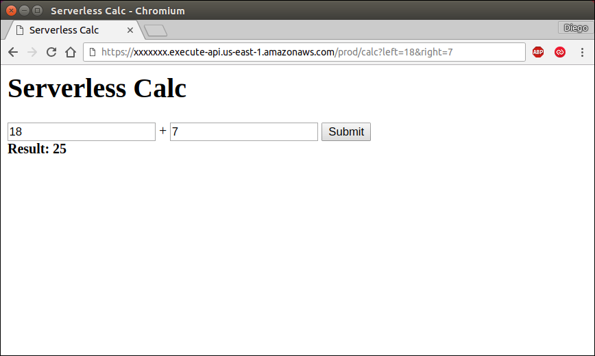
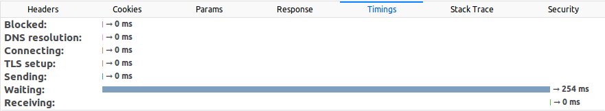
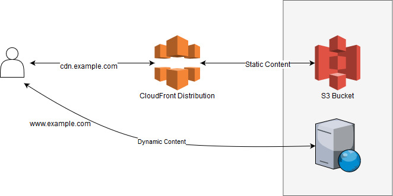
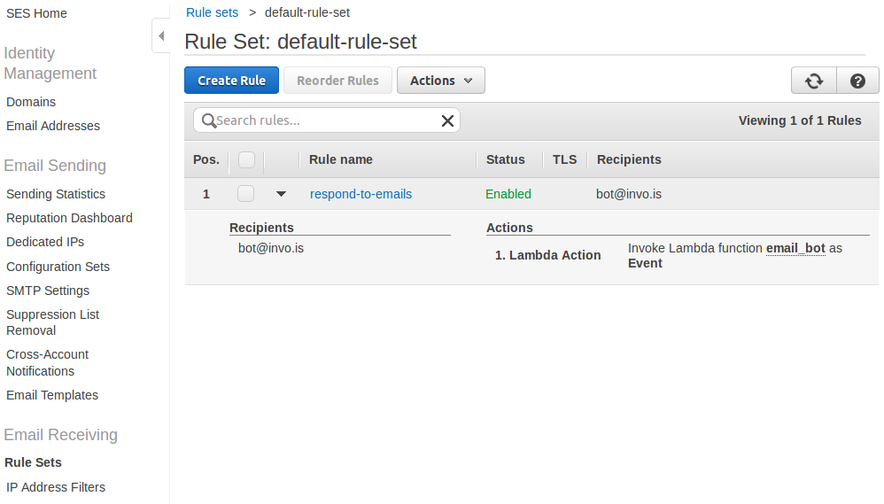
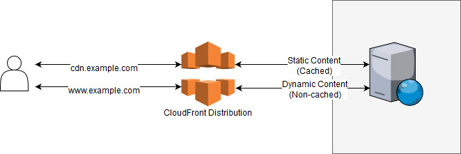

# Chapter 4: AWS Ecosystem

Amazon Web Services, or AWS for short, is the largest cloud hosting provider as of 2018. It was launched in 2006 and it has been growing since then, not just in customer base but also in service offerings. To understand its growth and why cloud computing is so important, it is necessary to understand what the main benefits of cloud computing are. First, the ability to manage our hardware as an application—create servers, add or remove storage, or reserve static IP addresses—with simple function calls is incredibly powerful as our application no longer depends on one fixed piece of hardware that takes time to replace. Our application can now work together with the hardware and reduce deployment times immensely, as servers can be built in a matter of minutes. Our second advantage is the elasticity of the environment; what used to be a fixed asset in the company now can last just a few hours, allowing us to grow or shrink on demand.

Why AWS? The truth is its competitors are also big players worth taking into account; Google, Microsoft, and IBM all offer similar services. The decision is complicated and it's necessary to consider several factors to answer that question, including their APIs, the features they support, and the costs based on our expected usage. Also, it takes time to understand how all the components play together and what are the necessary steps to perform the tasks we want. It's not an easy choice and each project deserves picking the right provider depending on its needs. AWS is, however, the market leader that has been proven to be reliable and fully-featured. In this chapter we are going to go through some of the services we can make use of and their most basic configurations. It would take probably a couple of books to go through all the available options and that's way out of the scope of this book; here, we'll just introduce the 'must-know' services and options.

AWS offers over 90 different services, which obviously cannot be explained in a single chapter. We will, however, discuss the key services that are useful for hosting a web application. We are going to explore the main services that will be needed later to host a serverless site and other core services. Lambda and API Gateway, probably the main services when it comes to serverless technology, will be introduced more in-depth in the next chapter.

Besides very few exceptions, all services in AWS provide three ways to perform tasks: using the web user interface (called Console), using the Command Line Interface (AWS CLI), or the SDK, which allows us to access the resources via code. There's an SDK for Python called *boto3*, but there are also SDKs for many other languages, including Java, .NET, PHP, C++, and others. While exploring the different services, we are going to give examples using any of those 3 connection methods, depending on the service, as some services are more useful to be accessed through one method than the other.

## Billing and Free Tier (Disclaimer)

A small disclaimer is needed here before we begin.

From now on and in several parts of this book, including in this same chapter, you could incur costs in your AWS account. AWS offers Free Tier for new and existing accounts where many services can be used for free for 12 months and some even forever. Of course, there are specific limitations in each of those services. For example, it's possible to create a small server, a small database server, a small cache server, host 5GB of data, and several other things totally free.

It's recommended to check the pricing page for each service before you perform any of the actions suggested. As of today, all the actions performed here fall under the Free Tier option and shouldn't cost anyone a dime, but it's always good to be careful as one single mistake can lead to a really high bill on your credit card.

My second recommendation is to visit the AWS Console and the pages specific to each service to make sure you are not incurring any unexpected costs.

## Getting Started

Before we can do anything, it's necessary to register at [https://console.aws.amazon.com](https://console.aws.amazon.com). While most examples here are covered under Amazon's Free Tier, you can incur some charges with the actions you perform in AWS. Once we have been approved and our account is created, we have access to all the different services. Most services are independent of each other, but there are some connections between them.

All the actions we will be performing can be easily done in the Console following a very intuitive interface. Just look for the service by name and follow each of the actions in the menu.

To perform actions using either the CLI or the API, we first need to configure our login credentials. We will explain exactly how to deal with users and permissions, but just to get started, go to the *IAM* service, select *Users*, and *Add User*. Enter a name for it and check the option "*Programmatic access*". Then select "*Attach existing policies directly*" and select the *AdministratorAccess* policy. That will create a new user and provide an Access key ID and a Secret access key. It's important to store those two values securely as they will give access to the entire account.

Once we have done that, we can configure our CLI tool (which can be downloaded from here: [https://aws.amazon.com/cli/](https://aws.amazon.com/cli/)):

```
> aws configure
AWS Access Key ID [None]: XXXXXXXXXXXXXXXXXXXX
AWS Secret Access Key [None]: xxxxxxxxxxxxxxxxxxxxxxxxxxxxxxxxxxxxxxx
Default region name [None]: us-east-1
Default output format [None]: json
```

Run `aws configure` to easily configure the credentials. The credentials are stored in the "%UserProfile%\\.aws" folder in Windows, or in the ~/.aws directory in Linux and Mac. Inside those directories a file called credentials is created with the Access key and Secret, and another file called config is used to store the other settings.

The Region is the name of the datacenter where you want to connect and run your commands by default. Even while not all services are supported in all datacenters, the ones we will be using are supported in all of them. The available region names and their physical locations are: us-east-2 (Ohio), us-east-1 (N. Virginia), us-west-1 (N. California), us-west-2 (Oregon), ca-central-1 (Canada), ap-south-1 (Mumbai), ap-northeast-2 (Seoul), ap-southeast-1 (Singapore), ap-southeast-2 (Sydney), ap-northeast-1 (Tokyo), eu-central-1 (Frankfurt), eu-west-1 (Ireland), eu-west-2 (London), sa-east-1 (Sao Paulo).

Once we have configured it, we can connect to AWS. Since we haven't explored any specific service yet, let's issue a simple command to get the current user information:

```
> aws iam get-user
{
    "User": {
        "UserName": "admin",
        "Path": "/",
        "CreateDate": "2017-12-01T22:20:09Z",
        "UserId": "XXXXXXXXXXXXXXXXXXXXXX",
        "Arn": "arn:aws:iam::532855000000:user/admin"
    }
}
```

`aws` is the name of the tool, `iam` the name of the service we are connecting to, and `get-user` the name of the action we are executing. In this case, without any additional parameters.

To do the same using the Python SDK, we first have to install a library called boto3. Do not confuse it with the old boto library that is no longer supported and has a slightly different syntax. Execute `pip install boto3` to download the library.

Using the library is very simple. First we need to import it, then get the client for the service we want to use, and, finally, execute the action. All the responses are dictionaries, which means we have to navigate the response using the ["Key"] notation.

**example.py**
```python
import boto3

iam = boto3.client("iam")
print(iam.get_user())
print()
print(iam.get_user()["User"]["UserName"])
```

Executing the file prints first the full output, and then the name of the current user:

```
> python example.py
{'User': {'UserId': 'XXXXXXXXXXXXXXXXXXXXXX', 'Path': '/', 'UserName': 'admin', 'Arn': 'arn:aws:iam::532855000000:user/admin', 'CreateDate': datetime.datetime(2017, 12, 1, 22, 20, 9, tzinfo=tzutc())}, 'ResponseMetadata': {'HTTPStatusCode': 200, 'HTTPHeaders': {'date': 'Fri, 01 Dec 2017 23:07:43 GMT', 'content-type': 'text/xml', 'content-length': '459', 'x-amzn-requestid': '6fea9546-d6ec-11e7-9fae-276ec48f00df'}, 'RetryAttempts': 0, 'RequestId': '6fea9546-d6ec-11e7-9fae-276ec48f00df'}}

admin
```

## Identity and Access Management (IAM)

One of the core components is the IAM service. IAM is offered free of charge and is used to handle all users and permissions. Let's explore its parts: Users, Policies, Groups, and Roles.

### Users

A user is a person or service that can connect to AWS and use its services. Users have a username and password to log in from the AWS Console (i.e., the website), and/or up to two pairs of secret keys you can use to log in using the CLI or an SDK.

The root user is the one you used to create the account. That root account cannot have its permissions limited and it is recommended that it is used for exceptions, such as viewing the billing information or creating other IAM users. Once other IAM users have been created, it is recommended to use those for everyday use.

### Groups

A group is just a set of users. They are useful when working on large teams and many members have the same access level. It is possible to assign multiple users to a group and then give or remove permissions to that group, which simplifies the administration of the different permissions.

### Roles

A role is very similar to a user, in a sense, with the difference that it doesn't have neither a password nor a secret key that allows you to log in as such. A role is something a user can *assume* to perform a specific task. *Assuming* a role means that the role gets assigned to the executing user for that specific session, inheriting all of its access permissions and restrictions. Here are 3 use cases where I have personally found roles to be useful:

- **Access resources from a server in AWS**: When you want to access data or services in AWS from a server running there, you can upload your application and specify the login credentials in your application. However, that means that you need to store those credentials securely and, if you have multiple servers or applications, rotating the credentials from time to time becomes a very time-consuming issue. Instead, from within the server (the EC2 instance as we will see soon), you can request temporary credentials that are already associated with the role your server has been assigned to. In other words, when you have a server running, you can assign a Role to it and, when an application running in that server requests access to an AWS resource, the application will be able to log in to Amazon using the permissions assigned to that Role.

- **Access resources in a different AWS account**: Let's say your company wants to give direct access to some of your data or services to another company. The best way to do this is by creating a Role with the desired permissions and then specifying who can *assume* such role. You can, for example, give access to manage your Route 53's DNS to a company that manages your network infrastructure. Then they can internally decide who does the job.

- **Give access across different services**: This is a very common scenario and we will even have to do this later when we learn about Lambda functions. Some services execute in your account under a specific role and it's up to you to decide what information that service has access to. For example, Elastic Transcoder is a service for processing media files, such as preparing audio and video for streaming online. Elastic Transcoder, however, needs to access your files and send you notifications when the conversion of the files is done. To do so, it *assumes* a role you own to access your files. Without those permissions, it wouldn't have access to your files.

### Policies

A policy is a set of rules that define what a user, role, or group can do. The policies can be created with a name and then assigned, or just created inline for a specific user, role, or group. Inline policies, however, are a bit harder to maintain and usually not recommended.

The policies are defined in JSON format and specify who and what can or cannot do. Let's see a simple policy example:

```json
{
    "Version": "2012-10-17",
    "Statement": [
        {
            "Effect": "Allow",
            "Action": "*",
            "Resource": "*"
        }
    ]
}
```

Let's examine what the policy above does. The first property in the JSON object is "Version"; it defines the schema that we use to create the policy. As of today, in 2018, the latest schema is from 2012. Do we need to remember what version is the latest? Of course not, IAM has a 'Policy Generator' that allows us to pick what permissions we want and it generates the JSON for us. Yet, it's good to understand what the policy means by reading the policy declaration.

Next, the statements are listed as an array in JSON format, as follows: [{ … }, { … }, …]. Each statement takes those 3 properties—Effect, Action, and Resource—and in some cases other properties for more advanced cases. All permissions are denied by default in AWS, but you specify whether the Effect of your statement is either Deny or Allow. Allowing or denying statements overwrite the default deny that AWS applies, but explicit denies have priority over explicit allows. That means that you can allow access to a certain group of resources and then explicitly deny access to one (or many) of them to apply a rule like "all except". The Action property can be either a string or an array of strings. In the example, "*" means 'any action'. We could also specify things like "ec2:*" to give full permissions to the EC2 service actions, or list the specific actions one by one; for example: ["s3:GetObject", "s3:ListObjects"] allows getting a specific object (i.e., file) and listing the contents (i.e., files) in the S3 service. The last property, "Resource", lets us limit the action to only some of the resources in the cloud. For example, if we are using the file storage service, S3, we can limit what files we have access to, or if we are running multiple servers in EC2, we could decide to give the user access only to certain servers, and so on.

IAM is one of the few services that you can use only through the AWS Console as there's no need for us to manage those permissions dynamically. In some applications, of course, you might need to do that.

## Simple Storage Service (S3)

S3 is one of the most basic services in AWS. It works similar, in a sense, to an FTP server, except it's way more powerful. The first difference would be that S3 is extremely redundant. All the files uploaded are stored in multiple availability zones within the region we choose; that means that if we decide to store our files in the Ireland region, the files are replicated in multiple locations with independent power supply and Internet connection in that country. That's one of the reasons that made the S3 service very reliable and popular. The other main difference, if compared to a simple FTP server, is that S3 is actually a key-value pair storage that does not know about directories. S3 simulates directories by grouping the files that have slashes in the keys, but it really doesn't care about them.

Let's jump in and create a Bucket. A Bucket is just a logical unit of storage where we can put files. When we create one we have to tell Amazon where to create it, that is, in which datacenter. This time we are going to use the CLI, but feel free to create it using the AWS website (Console) since it's way easier to do it there. Because the names are unique across all AWS customers, you won't be able to use the exact same name for the bucket that I will use here.

```bash
> aws s3api create-bucket --bucket learning-serverless-ireland-bucket --region eu-west-1 --create-bucket-configuration LocationConstraint=eu-west-1
{
    "Location": "http://learning-serverless-ireland-bucket.s3.amazonaws.com/"
}
```

Let's look at that command for a second: `aws` is the name of the tool, the first argument (`s3api`) is the name of the service we are going to use. There's actually an `s3` command group that has some higher-level commands for copying, removing, or syncing files around. The second argument (`create-bucket`) is the action we are going to execute. That means that we would need to have permissions to execute "s3:CreateBucket" in IAM. Since we are using the account with full permissions that we have configured at the beginning of this chapter, we don't need to worry about permissions for now. Then the `--bucket` parameter is used to specify the name of the bucket, and the `--region` to specify where our files will be placed. The buckets created in the US do not require that additional configuration at the end, but since we decided to do it the hard way and pick a region in Europe, we have to specify the LocationConstraint in order to run that command.

Once the bucket is created, we can start storing our files there. Assuming we have a file called hello_world.txt, let's see how we can upload it to our bucket using Python:

**2-s3/example.py**
```python
import boto3

s3 = boto3.client("s3")
bucket_name = "learning-serverless-ireland-bucket"

s3.upload_file('hello_world.txt', bucket_name, "chapter-4/hello_world.txt")

response = s3.list_objects(Bucket=bucket_name)
files = response["Contents"]
print([f["Key"] for f in files])
```

Here we are creating an S3 client, uploading the file using the upload_file function, and then listing the files stored in the bucket using the list_objects function. The output of executing such script is just the name of the file or files we have uploaded.

There are many things you can do with S3, without even mentioning how it interacts with other services. As this is not a book on S3, we will not go through all the options available, but it is worth mentioning the most common scenarios it can be used for. Below is a list of the most common options. Check the S3 API documentation or the AWS Console website to see how to specifically perform each of the things mentioned below, but they are pretty straightforward:

- **Manage buckets and files**: S3 allows you to create, edit, delete, and list buckets. You can perform the same operations, plus get/download, to single objects or files. It's also possible to upload big files using multipart uploads. That means the file gets uploaded in small parts and combined together in S3, which allows you to retry if a part upload fails.

- **Storage types**: It's possible in S3 to store data in different ways: Reduced Redundancy (less durable storage, but cheaper), Standard (the default), Infrequent Access (same durability as Standard, cheaper storage costs but higher transfer costs), and Glacier (same durability as Standard, but way cheaper and data not available in real-time).

- **Permissions**: S3 files can be configured to be completely public, private, or anything in between. Using IAM roles and ACLs you decide who can read or modify any object in your S3 bucket. Also, you can use the GetPresignedUrl method to get a link to your data that is valid for only a certain period of time and doesn't require sharing your credentials with anyone.

- **Static website hosting**: it's possible to point a domain directly to S3 and have it host the website directly from there, without paying for a separate server. Only static files (such as HTML, CSS, images, or JavaScript files) are supported.

## CloudFront

CloudFront is Amazon's Content Delivery Network, or CDN for short. A CDN is a group of servers distributed geographically that provide fast responses to users' requests with low latency. The main mechanism to provide fast responses is by caching the static content close to where the end user is. That way, when a user wants to download a picture or a JavaScript file, the CDN responds from the closest node (i.e., server) to their location. There are several competitors in this area that can be used; they vary in speed, edge locations (or number of servers or physical presence in specific countries), price, and configuration options. Other big competitors, just to name a few, are MaxCDN, Cloudflare, Rackspace, Verizon, and Level3. We are going to use AWS's here mainly because it integrates better with the other services we are using, but feel free to evaluate the cost and benefit of the other providers as well depending on what you are doing.

When it comes to the reasons why we are going to use a CDN, the first one is, obviously, the faster load time for the user. The second one is that the user doesn't hit our main servers to get all the static content, such as images, JavaScript and CSS files, etc. Associated with these, using CDNs usually provides better ranking in search engines and a better user experience.

It's not always a good idea to use a CDN though. If we are hosting a small website on our own server (or a shared one) where we have free capacity—that means, we can serve our own static resources without paying more—and the performance is not critical, then avoiding CDN can save us some money.

CloudFront supports several configurations, including: whether to use HTTP or HTTPS, where in the world to cache the data, compression, and cache duration. However, we will focus on one other configuration that is key: the Origin.

The Origin is where CloudFront gets the data from, and here we have 2 options available. The first one is an S3 bucket. We have to put all our static files in an S3 bucket and point CloudFront there. Then, our user can download the static resources from CloudFront/S3 and connects directly to our server to get the dynamic content. This is the more traditional approach, where all the images, CSS and JavaScript as well as any other static file (such as PDFs, CSVs, etc.) are served using the CDN. At the same time, all the dynamic content—everything that can change as soon as it's served—is served directly from our server.



The other possible Origin is a URL. With this option, we can point our CloudFront distribution to our server and, after it's requested for the first time, the response stays in the cache servers for a while to continue serving other users.

In both cases the website downloads the content from the main domain name (e.g., www.example.com) while the static content is requested from a different domain (e.g., cdn.example.com).

The difference is that CloudFront, instead of fetching the content from an S3 bucket, will make another request to our server. However, once it gets the response, the data will be cached and it won't make another request to our servers to get the same file for some time.



Both configurations are perfectly fine. Using a URL as origin has the advantage that it's easier to manage as we don't have to upload the static files to S3 every time we publish a new version of the application or every time a user uploads a file. Let's say a user decides to upload her profile picture to our website. With the first approach, we need to upload that same picture to S3 to have CloudFront find it there. If we use a URL origin instead, instead of making the request to www.example.com/pictures/user-123.jpg, we just change the domain name to our other domain and the CDN will take care of the rest.

There's a third setup that is also completely valid. Let's start with a picture that shows how it would look:



As you can see, it's also possible to direct all the traffic through our CloudFront distribution. The static content is cached while the dynamic content is not. You might be wondering why we want to put a proxy in front of our server. The reason is that, even for dynamic content, CloudFront can speed up the server's response and even protect our server from certain Denial of Service attacks.

The way it speeds up the connection without using cache is by reducing the roundtrip time required for the user to connect to the server, by reducing the SSL handshake time, and by keeping the connections to our server alive to eliminate the overhead a user has when connecting for the first time. The performance improvements can be more than 40% in the connection time when compared to not using CloudFront at all. The time our server takes to process the request and send the response is usually the main cause of long waiting times, which means that it really depends on our application and our servers whether a 100ms improvement is significant or not.

That being said, this third approach has significant advantages when it comes to security (it can protect us from a DDoS), connection speed, and even resource usage on our servers. There's no one-size-fits-all approach when it comes to reducing costs and keeping things simple, but when it comes to performance this whole-site configuration is worth trying.

## EC2 & RDS

"Elastic Compute Cloud" is one of the central services in AWS and the reason is simple: it lets us create server instances, something we haven't done until now. The servers we create here, called *instances*, are usually virtual servers that we can create and remove in a matter of minutes.

But wait, you could say, why are we talking about servers in a book that has *serverless* in its title? And you would be right. It would be crazy, though, to talk about AWS without mentioning its capability to launch and manage virtual servers. Also, RDS is a hosted relational database service that works on top of EC2 and shares some common terms. A full serverless architecture requires the database to work as a serverless system; that is, at least pay per use without the need to provision servers to handle demand changes.

In both cases, an *instance* is a server that exists in our account and we are billed for it until we "Delete" it (RDS) or "Terminate" it (EC2). Those instances are run in a datacenter, which Amazon calls Regions. There are several Regions available to pick from as we have seen while creating the S3 buckets. Regions are subdivided into Availability Zones (AZ), which are like sectors inside a Region that are isolated from other AZ in terms of power and connectivity. That means that if an AZ goes down, usually other AZ remain working, even in the same Region. For example, if we want to launch a server in the Region of Sao Paulo, Brazil, we have to select explicitly in what AZ we want the server to run. AZ are named with letters (i.e., *a*, *b*, *c*, *d*, …) and have no specific meaning other than to identify an isolated section in a region.

If we wanted to increase the fault tolerance of a service hosted in EC2, while not losing considerable performance, we could launch multiple servers in different AZ. Because AZ are close, the performance of connections between them is only slightly worse than within the same AZ. For even higher reliability, we would need to place multiple servers in multiple Regions, watching out for the high cost of inter-region communications. RDS goes one step further to simplify this: because RDS is a managed relational database service, it allows us to create Multi-AZ deployments, which creates multiple instances across multiple AZ with automatic failover.

Once we have decided where we want to place our instance, we need to pick the *Instance Type*. Instance types define the "size" of our servers: how many processors, how much memory available, the network and IO throughput, and of course, the price. Since there are tens of different instance types ranging from a fraction of a penny to several dollars in price, the only way to pick the correct one for each use case is to check the pricing pages and pick the one that fits our needs.

It's also necessary to mention another database service that AWS has: DynamoDB. DynamoDB is a key-value store that works with the pay-per-use pricing model and is extremely fast and scalable, making it very interesting for some very specific use cases. However, due to its simplicity and lack of a complex query processor (remember, it's a key-value store with limited support for secondary indexes), we will opt for a full database server for now.

### Defining the Security Groups

Besides mentioning the key services, there are other concepts related that are necessary to understand when building a solution in AWS. A Security Group (SG) acts as a virtual firewall, where a set of rules define the inbound and outbound connections that are allowed. The SGs are defined under the EC2 section in the Console. Once an SG is created, it can be assigned to certain resources and, in some cases, multiple SGs can be assigned to the same resource.

Some resources that support assigning SGs include EC2 instances, RDS instances, and Lambda. In the next chapters we are going to use both RDS and Lambda so it's important to know how to set up our firewall rules to allow the connections we need and block the ones we don't.

All rules in SG are Allow rules; if there's not a specific rule allowing a connection, then the connection is blocked. The inbound rules define who can connect to our resource and the outbound rules define the connections our instance can make to other resources, either in AWS or on the Internet. All rules are also *stateful*, which means that the responses to an allowed connection are also allowed. If an instance connects to a website on the Internet, its response will also be allowed regardless of the inbound rules. If we are hosting a web application on port 80 (the standard HTTP port), the responses our application generates on that port will be allowed regardless of the outbound rules.

SGs also have a very useful feature that traditional firewalls do not. A rule in an SG can be defined to allow a port to a specific IP address, a range of IP addresses, or an SG. By allowing a resource with a specific SG assigned to connect to resources with another SG, we don't need to maintain a list of specific IP addresses.

To better understand how this works, let's use an example and see the different ways we can configure this. We are creating a web application and it has an EC2 instance with a web server on port 80 (HTTP) and an RDS instance serving a MySQL database server on port 3306. The web server IP address will be 10.0.0.1 and the MySQL database server will have the IP address 10.0.0.200. All rules are for TCP connections in these examples and in each table we include the ID of the Security Group (starting always with *sg-*). Below are 2 ways to configure this scenario.

**Using IP addresses or IP address ranges (CIDR notation):**

| Web server Security Group. ID: sg-1111111 |  |  |
|-------------------------------------------|--|--|
| Rule Type | Port | Source/Destination |
| Inbound | 80 (HTTP) | 0.0.0.0/0 (ALL) |
| Outbound | 3306 (MySQL) | 10.0.0.200 (DB Instance) |

| Database server Security Group. ID: sg-2222222 |  |  |
|-----------------------------------------------|--|--|
| Rule Type | Port | Source/Destination |
| Inbound | 3306 (MySQL) | 10.0.0.1 (Web server) |

Those configurations work. However, if instead of a single web server we decide to have many, we would need to update the inbound rule of the database SG to allow connections from the IP range that the web servers have. So, if the web servers have IP addresses like 10.0.0.1, 10.0.0.2, …, 10.0.0.10 we could change our rule to allow connections from 10.0.0.0/24, which is the CIDR notation to define a range between 10.0.0.1 to 10.0.0.254. If we deploy our web servers in other regions with different IPs, it gets more and more complicated. The same would happen if, instead of adding web servers, we decide to add database replicas. It's easy to see how this can easily become more and more complex as we add servers.

**Using Security Groups:**

| Web server Security Group. ID: sg-1111111 |  |  |
|-------------------------------------------|--|--|
| Rule Type | Port | Source/Destination |
| Inbound | 80 (HTTP) | 0.0.0.0/0 (ALL) |
| Outbound | 3306 (MySQL) | sg-2222222 (DB Instance) |

| Database server Security Group. ID: sg-2222222 |  |  |
|-----------------------------------------------|--|--|
| Rule Type | Port | Source/Destination |
| Inbound | 3306 (MySQL) | sg-1111111 (Web server) |

This second example is very similar to the first one with one key difference: instead of referencing the instances by their IP address, we are doing it using the Security Groups they have assigned. If new servers are added using the same Security Groups, they will automatically have access to the other servers regardless of what IP addresses they are assigned.

In chapter 6 we are going to do something very similar to this: deploy a web application and database server. You can use any of these configurations to define your rules. If you are just testing and don't care about the security of the application, it's also possible to define a single SG with an allow-all inbound rule and an allow-all outbound rule.

## Aurora Serverless

> **Note**: This section is still in development - Aurora Serverless was announced as a new service for serverless databases.

More information: [AWS announces a serverless database service](https://techcrunch.com/2017/11/29/aws-announces-a-serverless-database-service/)

## SES

SES stands for Simple Email Service; it allows us to send and receive emails similarly to any other email server. For most use cases, the advantage is its simple administration and configuration. Because SES is very strict about what emails you send, it imposes some limitations though. Those limitations are enforced to ensure a good 'reputation' of their email servers, which helps get our emails in the Inbox and not in the Spam folder of our recipients. If you are planning on sending bulk unsolicited emails (and I hope not), you will need to find another email provider or use your own SMTP server.

The first step to send an email is to register our email address as a valid sender in AWS. Since this is something we usually do once per project, we are going to do it using the AWS Console. In the SES section, you can verify either a specific email address (e.g., noreply@example.com) or an entire domain (e.g., *@example.com). By registering a domain you can send emails from any address in that domain, but it requires that you have access to the DNS records. Registering a specific email address only requires that you have access to read emails sent there and be able to click on a link.

Let's register a specific email address we can use for testing. Go to *Email Addresses* and click on *Verify a New Email Address*. After following the on-screen steps (i.e., entering your email address and clicking on the link you received) you should have your address verified:



Now we are (almost) ready to start sending emails. Let's do that in Python; after installing boto3, create a new .py file as follows. Just replace the Source address with the email you just verified and the ToAddresses address with the recipient you want to send the email to.

**4-ses/sendemail.py**
```python
import boto3

ses = boto3.client("ses")

response = ses.send_email(
    Source='noreply@company.com',
    Destination={
        'ToAddresses': ['recipient@company.com'],
    },
    Message={
        'Subject': {
            'Data': 'Hello from AWS!'
        },
        'Body': {
            'Text': {
                'Data': 'Message body goes here'
            }
        }
    },
)

print(response["ResponseMetadata"]["HTTPStatusCode"])
```

After executing that code, you will probably get the following error:

```
botocore.errorfactory.MessageRejected: An error occurred (MessageRejected) when calling the SendEmail operation: Email address is not verified. The following identities failed the check in region US-EAST-1: recipient@company.com
```

We are getting that Message Rejected error because our AWS account is still in a sandbox to send emails. Did I say Amazon was very strict about the emails you send already?

To get out of the sandbox, go to the SES service, then to Sending Statistics, and you should see a message like the following:



Following the steps there, you can request Amazon to get your account out of the sandbox. While your account is sandboxed you can only send emails to and from addresses you have verified.

After we get our account out of the sandbox or have verified the recipient's address, we can try executing the same code again.

This time, the output will be 200, which is the HTTP status code for "OK". Also, you will receive the email you just sent in your mailbox.

## Understanding Pricing

> **Note**: This section is planned for future development - it would cover AWS pricing models and cost optimization strategies.

## Wrap-Up

There are many services in AWS and it's impossible to give them fair treatment in a single chapter. However, it's not necessary to know all of them to get started. Several years ago many of us started using only EC2 to host our existing applications and then we have been moving other parts to make better use of the other services that Amazon constantly adds.

There are services that solve both simple and complex use cases; even though we have only explored the most simple ones, it's worth looking at what the other services are for to avoid reinventing the wheel when working on a new project.

In the next chapter, things will get more interesting. We are going to go serverless!

---

[← Previous: Chapter 3 - Environments](03-environments.md) | [Next: Chapter 5 - Lambda Functions →](05-lambda-functions.md)