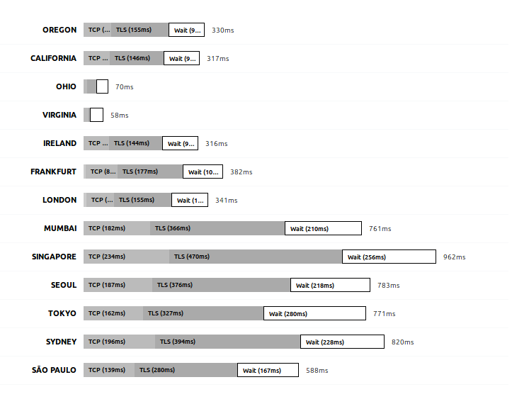
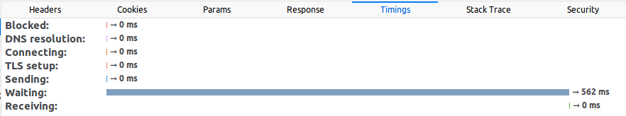
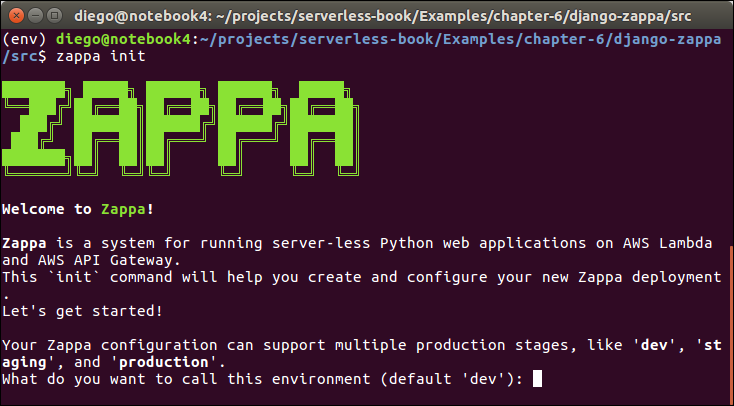
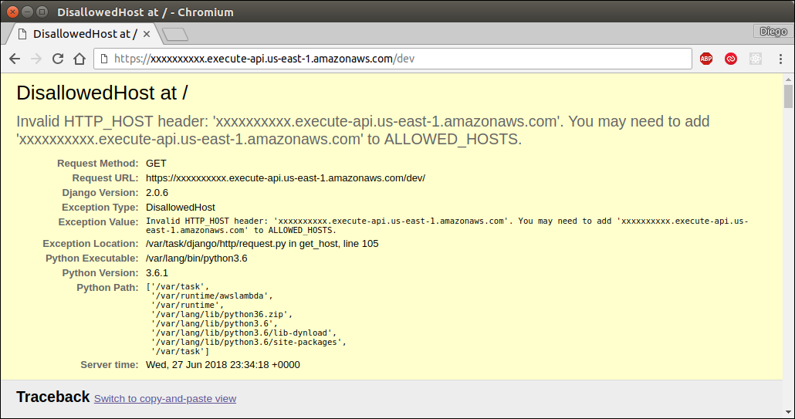
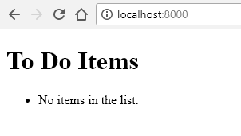
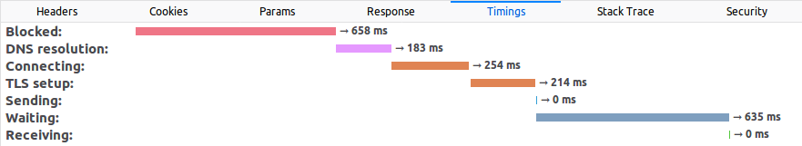
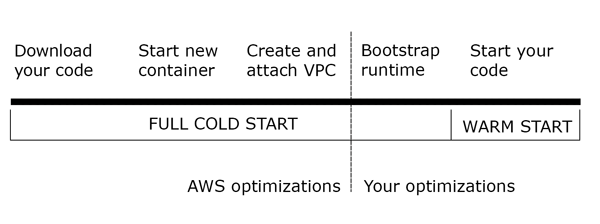

# Chapter 5: Lambda Functions

Lambda is the core of the serverless revolution in the AWS ecosystem. Microsoft's Azure has the *Functions* service and so does Google Cloud; all three accomplish the same task.

The great advantage of functions is, as we said before, that we only pay while our code is running and that they handle any scale up and down. After we create a function in our account, we can have it run multiple times in parallel without having to take any additional precautions. If the function stops being executed, we are not charged and there are no servers to remove.

A simple Lambda function is a small method written in any of the supported languages that runs on demand. When the function is executed, it receives a context of the event that triggered that execution and can optionally produce some output, interact with other services, and log information if needed. We are only charged for the time the function took to execute, rounded to the nearest 100ms. So, for example, if our function is executed 5 times and each time it takes 150ms, we will be billed for 1 second of execution time (5 times 200ms).

Lambda functions can be created in multiple languages, including .NET Core, Go, Java, Node.js, and, of course, Python. Once the function is created, it's up to us to decide when that function will execute; it can be on a schedule or as a result of an event, such as a file change stored in S3, a change in a DynamoDB database, or an HTTP request.

In this chapter we are going to manually create our Lambda functions to understand how they work in depth. However, in the next chapter we are going to use a tool to do all this configuration for us.

## Creating Our First Lambda

As our first Lambda, we are going to create one that sends a simple email. We will do everything from scratch to get a grasp of how it works internally and how we can manage everything from the CLI. After we are done with this step, we are going to improve it a little bit to respond to emails automatically from our Lambda.

Before we can do anything, we need to set up a few permissions. We are going to do this using the aws-cli, but we could easily do this in the AWS Console. In fact, you will find that it's easier to do it in the Console following the on-screen instructions, but to get a better understanding of what we are actually doing, the CLI will be used.

We need to create an IAM role that Lambda will use to execute our function and interact with other services. When our Lambda function tries to perform any operation on another AWS resource, whether it's an S3 file or sending an email, it will assume a role. By assuming a role, it will request access to AWS as such. AWS will return temporary credentials of a user with the same permissions as the assumed role, even though that user won't show up in the IAM console. Also, we don't even need to manage those credentials manually.

So, let's create a role using the CLI:

```bash
> aws iam create-role --role-name lambda_send_email_role --assume-role-policy-document file://assume-role-policy.json
```

We are calling the "create-role" command in the IAM service, specifying the role's name and the *assume role policy document*. That policy is the one that's going to state who can assume that role. Because assuming that role gives all the permissions it has to whoever assumes it, it's very important to make sure only the ones we want can assume that role.

Our policy document, placed in the same directory where we executed the previous command, will look like this:

**1-simplefunctions/assume-role-policy.json**
```json
{
  "Version": "2012-10-17",
  "Statement": {
    "Effect": "Allow",
    "Principal": {"Service": "lambda.amazonaws.com"},
    "Action": "sts:AssumeRole"
  }
}
```

Again, that file can be generated using the Console, so there's no need to remember the exact syntax or type all that manually.

The next step is to assign some permissions to our role since, so far, it cannot do anything. To do so, we need to attach a Policy. We can either use an inline policy or create a policy and then assign it to the role. For simplicity, our policy will be assigned inline and it's defined as follows:

**1-simplefunctions/role-policy.json**
```json
{
  "Version": "2012-10-17",
  "Statement": [
    {
      "Effect": "Allow",
      "Action": [
        "logs:CreateLogGroup",
        "logs:CreateLogStream",
        "logs:PutLogEvents"
      ],
      "Resource": "*"
    },
    {
      "Effect": "Allow",
      "Action": "ses:SendEmail",
      "Resource": "*"
    }
  ]
}
```

That will give us access to send emails and log information to the CloudWatch service, which is useful for auditing and debugging. To assign the policy to the role:

```bash
> aws iam put-role-policy --role-name lambda_send_email_role --policy-name lambda_send_email_policy --policy-document file://role-policy.json
```

Now we are ready to start coding our function. Let's create a file called say_hi.py with a function in it. Our function will be called lambda_handler, but it could be named anything. Inside the function, we are going to load the from and to email addresses from 2 different environment variables and send an email as we did in the last chapter. Here's our code:

**1-simplefunctions/say_hi.py**
```python
import boto3, os

def lambda_handler(event, context):
    from_address = os.environ["FROM_ADDRESS"]
    to_address = os.environ["TO_ADDRESS"]
    
    ses = boto3.client("ses")
    response = ses.send_email(
        Source=from_address,
        Destination={
            'ToAddresses': [to_address],
        },
        Message={
            'Subject': { 'Data': 'Hello from AWS!'},
            'Body': { 'Text': { 'Data': 'Message body goes here' } }
        },
    )
```

The function is fairly simple but it's our first example of a Lambda function communicating to something outside AWS, in this case via email.

To publish the function, first we need to compress it in a Zip file. In this case it looks like an unnecessary extra step, but when our Lambdas grow bigger and have several files and dependencies, compressing our Lambda in a single file makes more sense.

Let's compress our file using the zip command and then upload our function using the create-function command:

```bash
> zip say_hi.zip say_hi.py
> aws lambda create-function \
    --function-name say_hi \
    --runtime python3.6 \
    --role arn:aws:iam::532000000000:role/lambda_send_email_role \
    --handler say_hi.lambda_handler \
    --timeout 10 \
    --publish \
    --zip-file fileb://say_hi.zip \
    --environment Variables="{FROM_ADDRESS=from_address@company.com,TO_ADDRESS=to_address@company.com}"
```

Let's see what that does. We are creating the function and, for that to happen, we have to specify several parameters (again, you can do this with a few clicks in the AWS Console without having to remember all those parameters or check the documentation). The parameters are:

**--function-name**: The name of the function that will be used in AWS. It doesn't have to match our file's name.

**--runtime**: The 'engine' that will be used to execute our function. It can also be python2.7, nodejs, java8, and others. We will use Python 3.6 here.

**--role**: The ARN (Amazon Resource Name) or unique identifier of the role. If unsure about the ARN of the role we just created (it was displayed in the response when we created the role), we can get it as follows:

```bash
> aws iam get-role --role-name lambda_send_email_role
```

**--handler**: This is the entry point for our function. The full name consists of the name of the file (including packages) plus the name of the Python function itself.

**--timeout**: It defaults to 3 seconds, which would have been enough for sending a simple email. We need to make sure our function can execute within that period of time. Setting it too high could lead to higher costs if our function is not working as expected, however.

**--publish**: This tells Lambda to create a specific version (which cannot be later modified). The Lambda versioning system allows us to have multiple environments, such as Development, Staging, and Production, and to decide which Lambda responds to the public. We'll get to this option in more detail later in this chapter.

**--zip-file**: The path to our compressed file, specified with the fileb:// prefix.

**--environment**: Using this parameter we can specify the environment variables that will be available in our function. This is useful in several ways; for example, it allows us to avoid having to upload a new version or change the code of our functions if we want to change a general parameter in the system.

Now that we have successfully created our Lambda function, we can execute it with a single line:

```bash
> aws lambda invoke --function-name say_hi invoke_output.txt
```

This will execute the latest version of our Lambda and write the output to the invoke_output.txt file. You should have gotten an email if you followed all the steps correctly.

## Creating an Email Bot

Let's make this a little bit more fun. Invoking the Lambda functions manually or using a script can make some sense in some cases, but one of the beauties of Lambda is that it can react to events and act based on the information it received.

To do this, first we need to configure SES to receive emails from a domain we own. The steps for doing this are a bit out of the scope of this chapter and are pretty easy to do in the Console. First, we need to verify a domain in SES; in the previous chapter we have verified a single email address, but because receiving emails requires the NS domain records to point to Amazon, we need to verify an entire domain in this case.

One common use case is to use the domain as usual for sending and receiving emails and having a special address to respond automatically. For example, the website Kayak allows us to organize our trips online (i.e., flights, hotels, car rentals, etc.). If you forward a flight ticket confirmation email to *trips*@kayak.com, they will automatically process your reservation and add the reservation to your itinerary. Of course they also use other emails under their domain, so it wouldn't be practical to associate the entire domain with Amazon. The correct way to set up that scenario is to verify only a subdomain in SES, such as ses.domain.com and forward all the emails sent to trips@kayak.com to an email address under that subdomain; for example, trips@ses.kayak.com.

Before we finish configuring SES, let's create another Lambda that responds to our emails. From the AWS Documentation we know that the event our Lambda function receives will have contents similar to the following (parts omitted for brevity):

```json
{
  "Records": [{
    "ses": {
      "mail": {
        "timestamp": "2018-04-27T22:51:09.085Z",
        "source": "email-address@company.com",
        "commonHeaders": {
          "from": ["Sender Name <email-address@company.com>"],
          "subject": "Subject of the Message is Here"
        }
      },
      "receipt": {
        "recipients": ["bot@company.com"],
        "spamVerdict": { "status": "PASS" },
        "virusVerdict": { "status": "PASS" },
        "spfVerdict": { "status": "PASS" },
        "dkimVerdict": { "status": "PASS" },
        "dmarcVerdict": { "status": "PASS" }
      }
    }
  }]
}
```

With such information, we can write our Lambda as follows:

**2-email-bot/email_bot.py**
```python
import boto3, os

def lambda_handler(event, context):
    from_address = os.environ["FROM_ADDRESS"]
    
    email_headers = event["Records"][0]["ses"]["mail"]["commonHeaders"]
    to_address = email_headers["from"][0]
    subject = email_headers["subject"]
    
    ses = boto3.client("ses")
    response = ses.send_email(
        Source=from_address,
        Destination={
            'ToAddresses': [to_address],
        },
        Message={
            'Subject': { 'Data': 'Message received'},
            'Body': { 'Text': { 'Data': 'Message: ' + subject } }
        },
    )
```

The email information is being received in the event object, where we can dig a little bit to extract the sender address and the subject. If you are like me, you probably didn't like all those dictionary lookups to find the headers of the email. For a real use case I would suggest extracting that part into a different function and doing some type checking, unit testing, and error reporting.

There are two other things that are interesting in the event's data. First, the body is not being included; a lot of data has been removed to accommodate all the data here, but the body was not one of them. The body is not included in the event; it's possible to work around this limitation by saving the email message in S3 when we set up the SES rules (which we will do next) and then retrieve that S3 object from our Lambda function. The second one is, under the 'receipt' element, we can see that AWS did some verifications before executing our Lambda function. Namely, it has checked our email for viruses, spam, and email sender verification.

Go ahead and upload that new Lambda. In this case we are creating a new one using the Console and pasting the code directly in its web editor. This way works just fine and makes one-time deployments easier.

Once we have verified the domain and created our Lambda function, we have to create a Rule in SES. Our rule is very simple: it accepts emails sent to any address in any of our verified domains and executes the Lambda function we have just created. The configurations look like this:



With our SES rule configured and the Lambda function working, we can test our new server.

## Running on Development

Once we have developed our function and have modified them a few times, we quickly realize that it's a bit cumbersome to have to compress, upload, and execute a new version of our code to test it every time. As the code grows in size, it will even take longer to upload, making the whole development process really slow.

There are a couple of ways to execute our Lambda function directly on our development machine. It's straightforward to just launch a python console, import our main file, and execute it. The problem with this approach is that our environment might have several differences when compared to the one where our Lambda is executed. A better way to do this is to use a Docker image that is pre-configured to simulate the Lambda environment.

The LambCI project provides Docker images that mimic almost identically the configurations found in a Lambda function, as they describe it:

*"... including installed software and libraries, file structure and permissions, environment variables, context objects and behaviors – even the user and running process are the same."*

Executing our previously developed functions requires only a single command. However, let's configure our environment variables first. Create a file with any name that contains the environment variable names and values, one on each line, in the format key=value. For our first Lambda (the one that sends always a static email whenever executed), our variables are as follows:

**3-docker-lambda/env_list.txt**
```
FROM_ADDRESS=from@company.com
TO_ADDRESS=to@company.com
AWS_ACCESS_KEY_ID=XXXXXXXXXXXXXXXXXXX
AWS_SECRET_ACCESS_KEY=XXXXXXXXXXXXXXXXXXXXXXXXXXX
```

There we are including our From and To addresses, and also the AWS access keys. The access keys are only required because we are connecting to another AWS service to send the email, but they are not strictly necessary.

To run our function locally, then we execute:

```bash
> docker run --rm \
    -v "$PWD":/var/task \
    --env-file ./env_list.txt \
    lambci/lambda:python3.6 \
    say_hi.lambda_handler
```

Let's start from the back. The last 2 parameters must be the Docker image and the command to execute. The image we use is lambci/lambda:python3.6, but there are images available for all the different languages (i.e., .NET Core, Go, NodeJS, etc.) and the command is the handler we configured in our Lambda; for our first example, that's say_hi.lambda_handler. The --env-file argument loads all the environment variables from the file we just created, the -v argument allows our Docker container to read the files from our current directory—to avoid having to copy the files manually inside the container—and the --rm indicates Docker to remove the container after the command exits.

The output of our execution will be, unsurprisingly, very similar to what Lambda would output in the logs:

```
START RequestId: 8ee8fb91-5a4a-459a-bda9-1aaf6bbbb5de Version: $LATEST
END RequestId: 8ee8fb91-5a4a-459a-bda9-1aaf6bbbb5de
REPORT RequestId: 8ee8fb91-5a4a-459a-bda9-1aaf6bbbb5de Duration: 1138 ms Billed Duration: 1200 ms Memory Size: 1536 MB Max Memory Used: 28 MB
```

Moving on to our second Lambda, the one that received an event from SES when an email arrives, if we execute it using the same (modified) command, we'll get an error as no event argument is being passed. The way to pass an event to our Lambda container is by appending the event at the end, for example:

```bash
> docker run --rm \
    -v "$PWD":/var/task \
    --env-file ./env_list.txt \
    lambci/lambda:python3.6 \
    email_bot.lambda_handler \
    '{"Records": [1,2,3]}'
```

At the end of the command we added the '{"Records": [1,2,3]}' as a way to show how to send an event. However, the real event that our Lambda receives is around 6KB long for this specific example, which makes it pretty inconvenient. Another, better, way to send event information is to use the STDIN to send the file. To do so, first we need to add the environment variable DOCKER_LAMBDA_USE_STDIN=1 as a new line in our env_list.txt file. This way we are telling the Docker container to receive the event from the standard input. With that set, we can use the cat command to read the file and stream it to our docker run command, as follows:

```bash
> cat ses_notification_example.txt | \
    docker run --rm \
    -v "$PWD":/var/task \
    --env-file ./env_list.txt \
    -i \
    lambci/lambda:python3.6 \
    email_bot.lambda_handler
```

Also note that we have added the -i argument to our execution. The reason is that Docker executes the container in the background and doesn't receive any input, but if we add that argument we can use the keyboard to *interact* with the container, or in this case send the entire file using the STDIN stream.

## Lambda Versioning

After we are done with the testing on our local machine, we might want to deploy our code to a production-like environment. Whether it's a Testing or Staging environment, Lambda allows us to have multiple versions of the same function and pick which one we want to use.

Each time we create a new version, we are saving a "snapshot" of the function as it is. The code of the Lambda cannot be changed for that version and it gets assigned a number. When we upload a new function, its full name will have the following format:

```
arn:aws:lambda:aws-region:acct-id:function:name:$LATEST
```

For example, our email_bot function, uploaded in the *us-east-1* region, will be named something like this:

```
arn:aws:lambda:us-east-1:530000000000:function:email_bot:$LATEST
```

If we decide to *publish* the function, AWS assigns a version number to it. For example, if we decided to publish our email_bot function, it would create a function with ARN:

```
arn:aws:lambda:us-east-1:530000000000:function:email_bot:1
```

Publishing the function again would create :2, :3, and so on. If the version information is not added after the function name, the :$LATEST is appended automatically. This way, when we configure a trigger in SES, S3, or any other service, we are pointing to a specific version of our Lambdas.

The "Latest" version is a special *alias* that points to the latest version of the function. Aliases are like unique tags we can point to specific versions of a function. An alias "PRODUCTION" could point to version 23, while an alias "TESTING" could point to version 30 (note, it's newer than the production one) and an alias "DEV" could point to the $LATEST version. With those aliases in place we can make our code or AWS services trigger specific versions of the same function. Aliases help us update our function code without having to update the services in other services; if an S3 event is pointing to a specific version of a Lambda, such as :23, then updating our Lambda code would also require updating S3 to use the newer function.

When we created our first Lambda in this chapter, we decided to use the --publish argument which automatically assigns a new version number to the uploaded Lambda. If we don't specify that parameter, all the updates of the function overwrite the latest code. Once the code was uploaded, we can still publish the current version of the Lambda to assign a unique version number to it. The --publish parameter is just a shortcut to create a new version of the just-uploaded code.

## Making our Lambda Public

Our main goal is to create a web application using Lambda, so the next step is to make the functions publicly available. Because Lambda functions don't have an HTTP endpoint—that means it's not possible to make an anonymous request from a browser to have the function executed—another service is required to translate the HTTP requests to the Lambda execution and its results back to the HTTP response. That service is called API Gateway.

API Gateway, as its name suggests, is intended to provide API support, documentation, versioning, authentication, request throttling, and much more. The API itself can be hosted anywhere, Lambda being one of those possible locations. When a request is made from the browser, API Gateway will handle the call, forward it to Lambda, and return its result to the browser. The response, however, can be either a JSON object, an HTML page, or basically anything we want. API Gateway treats responses as JSON by default, since that's how most modern REST APIs work nowadays, but we'll see how we can change that later.

Let's create a simple API that returns the sum of 2 numbers. That's a trivial example but the important work here won't be in the code itself but in the configurations (which we will later delegate to a library to do for us).

First we need to create our Lambda function. It will be very simple; it will expect 2 parameters from the query string called "left" and "right" and it will return a JSON object with the sum of both parameters:

**4-api-gateway/json-api.py**
```python
import json

def lambda_handler(event, context):
    left = int(event["queryStringParameters"]["left"])
    right = int(event["queryStringParameters"]["right"])
    
    return {
        'statusCode': 200,
        'headers': {},
        'body': json.dumps({"result": left+right})
    }
```

In our lambda_handler method, we receive the request information in the event variable; we parse that information to get the query string parameters. It might need a little bit of debugging to find what the names of those parameters are, but it's easy to see them by issuing a few print statements for example and checking the results in CloudWatch Logs. Once we get our parameters, called left and right, we return our response. API Gateway will expect a response that includes the HTTP status code (where 200 means "OK"), the response HTTP headers, and the response body itself. For the response body, we are using the standard Python library json, which with a simple call to json.dumps lets us convert an object into JSON.

To set up API Gateway, we have to do the following steps in the AWS Console:

1. **Create an API**: Enter name and description
2. **Create a new Resource** inside the API. The resources are the directories that will be available. In the root URL (i.e., /) the default resource is located. That root resource can contain others, such as /users or /posts as well as resources that receive parameters and other sub-resources. For example, /company/users/{username} indicates a resource with any name (which will be stored as the username parameter) which is available under the 'users' resource, which is at the same time under the 'company' resource. In our case, we will create a resource called /calc.
3. **Create a Method**: A method refers to an HTTP Method, such as GET, POST, PUT, etc. We are going to create a method inside our new resource for HTTP GET requests.
4. **Deploy the API**: When we deploy the API, we publish all the configuration and make our API public. While we do this for the first time, AWS is going to require creating a new Stage in our API. Stages allow us to have multiple versions of the API and use them during our development lifecycle, such as testing, staging, and production. We are going to create a single stage called "prod".

Once we have deployed our API, we can go to the Stages section to get the URL of the published endpoint. It should look something like this:

```
https://xxxxxxx.execute-api.us-east-1.amazonaws.com/prod/
```

Where the /prod/ at the end of the URL is the name of our Stage. Since we have created a resource called /calc/, we also need to add that at the end of our URL. To execute it using cURL, we need to execute the following:

```bash
> curl "https://xxxxxxx.execute-api.us-east-1.amazonaws.com/prod/calc/?left=15&right=20"
{"result": 35}
```

It worked! We have made a call to our service using cURL in the terminal; that HTTP call was routed to API Gateway, who delegated the call to our Lambda function. The function was executed, added the 2 parameters we specified in the query string (left and right), and returned a JSON response.

Let's modify it a little bit to create our first web application. The difference in this case is that we want to return HTML instead of JSON. In our previous JSON-returning function, we were returning a headers parameter in our response. It was left empty in that case because the default content type for API Gateway is JSON, but we are free to overwrite that.

**4-api-gateway/html-lambda.py**
```python
import json

bodyTemplate = """
    <html>
    <head>
        <title>Serverless Calc</title>
    </head>
    <body>
        <h1>Serverless Calc</h1>
        <form method="GET">
            <input type="number" name="left" value="{left}" /> +
            <input type="number" name="right" value="{right}" />
            <button>Submit</button>
            <br>
            <strong>Result: {result}</strong>
        </form>
    </body>
    </html>"""

def lambda_handler(event, context):
    queryString = event.get("queryStringParameters", None)
    left = 0
    right = 0
    
    if queryString:
        left = int(queryString.get('left', 0))
        right = int(queryString.get('right', 0))
    
    body = bodyTemplate.format(result=left+right,
        left=left,
        right=right)
    
    return {
        'statusCode': 200,
        'headers': {
            'Content-type': 'text/html'
        },
        'body': body
    }
```

Things got a bit more complicated here, but only because we are doing everything manually, which is not normally what we would do. In the next chapter we will use a tool to do all this automatically and be able to support Django templates.

The improved function has a string template for our response, in which we are adding the full HTML response, including a form tag with 2 inputs and a submit button. The HTML response is passed to the body of the response, but we are also passing an additional header to make sure the browser understands it correctly. Content-type: text/html is the standard HTTP header to mark the response as HTML.

We also improved our parameter handling at the beginning of the function: by using the get method instead of brackets to access keys of a dictionary, we can pass a default value as the second parameter (instead of having the dictionary raise an error). If we did queryString["left"] and "left" is not in the dictionary, it would raise an error. Instead, queryString.get("left", 0) tries to find that key in the dictionary and if not found, it returns whatever we have passed as the second argument (0 in this case).

If you visit the URL in the browser this time, you will see a beautiful (well, maybe not) calculator:



## Execution Times

Let's execute that page that we just created and look at the time it takes to execute. Using the Firefox or Chrome Developer Tools we can look at how long it takes to execute the request:



The first time we execute it, it will take some time "Blocked" (waiting for a connection), some time resolving the DNS (that is, translating the domain name into an IP address), connecting to the server and doing the SSL handshake (the initial HTTPS connection always takes longer). After all that, when the connection is established, it takes another 635ms waiting for the response. Let's compare that against a request to www.yahoo.com for example:



Yahoo's server responds a little faster from my current location, but it can vary based on a lot of different factors. The time spent from the beginning (in Blocked) until Sending can be slightly improved but it really depends on the computer, your physical location in the world, the server's physical location, and the intermediary services. Maybe switching to a different DNS provider or another AWS region will lead to better results, but that's not really important because all that time is usually spent only during the first connection.

If we wait 10 minutes (you will understand why soon) and refresh the page, the timeline now looks like this:



The time spent resolving the DNS, connecting, and so on is down to 0ms. That's because the DNS resolution was cached by the OS or by the browser and the SSL initial setup was already done. However, our request still took around 600ms to execute while Yahoo's took half of that.

Let's execute the request one more time:



Now you can see that the time to execute the same request went down to 250ms. All those timings will vary significantly each time you issue a request and even more if you do it from different locations, but you arrive at the same conclusion every time: the first request takes longer than the successive ones. In this trivially simple function, it takes 200-300ms more, but if the function is big and includes external libraries, the initial request can take several seconds.

The reason for this is explained by how Lambda works. Despite being 'serverless', a server does obviously exist that executes the requests—we just don't have to administer it. That server loads the function code when it receives the first request and then executes it. That loading time is the penalty the first request has to pay. The following requests will use the same loaded function and only the real execution time is accounted for in those cases.

Letting some time pass will make the Lambda server remove our code from memory to save resources and, when a new request comes, the function will have to be initialized again. This is the same problem that we will see if 2 or more requests have to be executed at the same time. Lambda is great at scaling, but each time a function has to be executed more than once in parallel, it requires another server to respond internally. So, as long as the Lambda is active (a.k.a. warm) it will not need to pay the loading time penalty, but each time a new server is needed to execute a function, either the first time or for each additional execution in parallel, the execution time will be increased. We will go deeper into this topic in chapter 9.

There's a solution for this and that is keeping the Lambda warm. To keep the Lambda warm we need to execute it from time to time. For example, if we execute the function every 5 minutes, it is less likely that it will be taken down during that time and we will have to pay the penalty for the loading time. Deciding how often we have to execute the function to keep it warm is a mystery as AWS doesn't state exactly for how long it keeps the functions active before releasing resources. Experiments have shown that sometimes executing the function once an hour is enough to keep it warm and sometimes even executing it every 15 seconds is not enough to avoid AWS from taking it down. A common approach is to execute it every 5 minutes or so, which is an arbitrary amount of time but that has led to good results for many users. Executing the function every 5 minutes has almost no cost (and it's within the AWS Free Tier) and lets us reduce that slow start time.

CloudWatch, AWS's monitoring service, can help with this task. In order to execute our Lambda function, we need to go to Rules in the CloudWatch console and create a rule to execute the function we want on a periodic schedule. The configurations can be seen in the following screenshot:



We only have to set the Event Source to be scheduled on a *Fixed rate of* 5 minutes and to target our function name. In the next step we have to enter a name and description for our rule and our function will be executed regularly.

Our function can execute in very little time and, in all my tests, within the minimum billable period of 100ms. It doesn't perform any permanent changes in a database or files, so it's suitable to execute it 'as-is' every few minutes. If that wasn't the case, however, we might not want to execute it automatically. If the function executes some complex task such as downloading images from an external site, or even updating the database with site visit statistics, we might want to make sure that those tasks are executed only when a real request from a user is performed.

In order to detect if the function is being executed from a CloudWatch Rule or not, we can simply add an if statement at the top of our function:

**4-api-gateway/html-lambda.py**
```python
# ... 
def lambda_handler(event, context):
    if event.get("detail-type", None) == "Scheduled Event":
        print("Keeping the function warm!")
        return
    # ...
```

How did we know what to check? When the rule is created in CloudWatch, there's a small link under the Schedule that says "*Show sample event(s)*". Expanding that section shows how the event is going to look in your function and, as you might have guessed, it's an object that includes { "detail-type": "Scheduled Event" } among other properties.

## Wrap-Up

In this chapter we saw how to manually create Lambda functions. They are pretty fast and don't require any servers running or installing operating system updates, making them incredibly appealing. We also used API Gateway to route the HTTP requests from the browser to the Lambda function and back to the browser. Both services in conjunction let us build either classic web applications or background tasks that execute based on things other than a regular HTTP request (such as the email bot).

All this comes at a cost: functions are not particularly easy to configure and, if you have hundreds of them, it would be a nightmare to manage the different versions and API Gateway configurations. In the next chapter we will introduce a tool to simplify all these tasks. It is important to know how the underlying architecture works as it might help you solve issues in your code or decide to create and publish the Lambda functions manually in certain scenarios.

---

[← Previous: Chapter 4 - AWS Ecosystem](04-aws-ecosystem.md) | [Next: Chapter 6 - Deployment Tools I: Zappa →](06-deployment-tools-zappa.md)