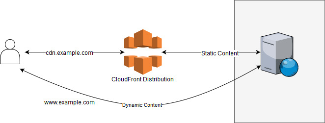
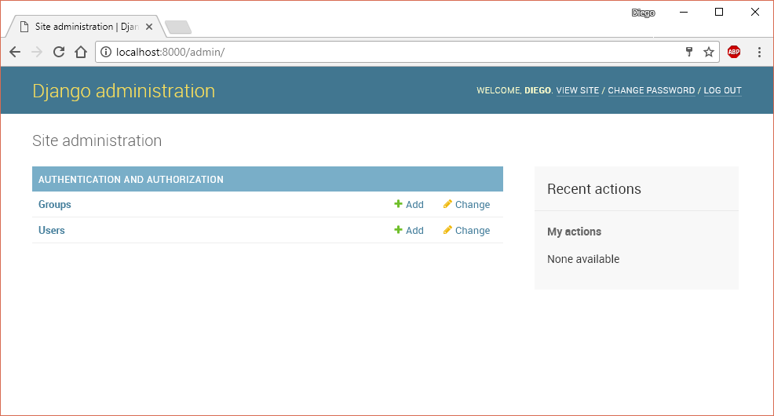
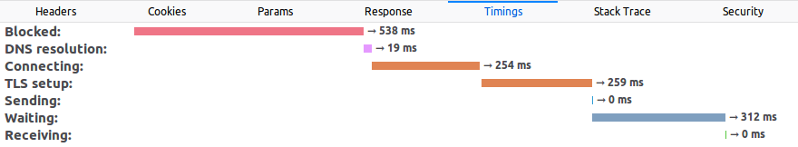
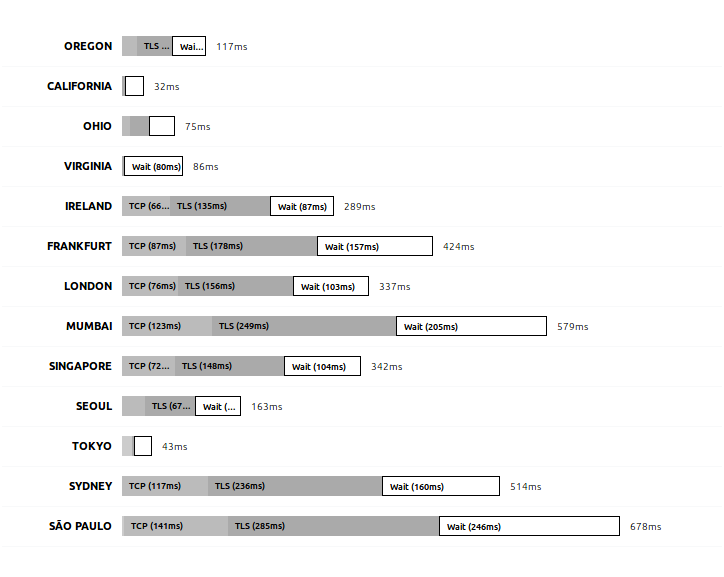

# Chapter 6: Deployment Tools I: Zappa

Running an application serverless is a great deal as scaling becomes easier and takes the server administration tasks off of us. The calculator we did in the last chapter is incredibly scalable and involves zero running costs when there are no users.

I'm not going to be surprised if you are laughing at me now as the calculator we did had two clear problems. First, it was trivially simple: not only does nobody need a calculator, but it could also have been built in many other ways that are free or very cheap when there are almost no users. And second, it was hard to deploy: publishing the Lambdas and configuring all the services manually is pretty tedious as it involves lots of steps.

In this chapter we are going to use a tool to deploy a Django project into AWS Lambda. Django and similar projects like Flask let us develop complex projects in an organized way and make use of a lot of useful libraries, which would definitely allow us to solve the first issue (trivially simple example). Also, we are going to introduce a tool called *Zappa* that automates the entire deployment process; this is going to make the deployment easier.

## Introducing Zappa

Zappa is an open-source MIT-licensed project created by Rich Jones and available on GitHub (https://github.com/Miserlou/Zappa). This tool/library allows us to deploy, configure, and manage our Python web apps in AWS Lambda. It can be used with many Python frameworks and libraries including Django, Flask, and Pyramid.

Using a few commands in the console we will be able to do everything (and way more) that we did in the previous chapter. Because we already know how to set up API Gateway and Lambda manually, Zappa will be easier to understand. When we publish something using Zappa, it will basically do the following:

- **Remove unnecessary files**: Some files are not necessary in our application. We have the option to exclude files manually, but besides those, it will exclude files such as the Boto library. The Boto library (the one we used to connect to AWS services) is already included and available in Lambda, so there's no need to upload it again. The files with extension .py are also not needed if there's a .pyc file already present (.pyc files are the compiled versions of the .py files where the source code is).

- **Package our application**: The application code, along with all the dependencies, are put into a package that runs well in Lambda. The dependencies are not only included, but also replaced by the Lambda-compatible version. AWS Lambda runs on a specific version of Linux and that requires that the correct dependencies are included; a library compiled on our local machine could have problems running in the architecture that Lambda uses internally.

- **Upload the package to S3**: We published our functions directly by uploading the code to Lambda, but it's also possible to point Lambda to a file hosted in S3. That makes our functions a bit easier to manage and places all the code in a single place. As an additional advantage, this will solve a size limit problem that Lambda has when the project is larger than 50MB (as of June 2018).

- **Set up AWS Services**: Zappa configures Lambda, API Gateway, and IAM roles to serve the HTTP directly from Lambda.

- **Keep our Lambda warm**: As we did with a CloudWatch scheduled rule, Zappa will configure that for us.

Neat, right? Those are just the basic steps when doing a normal deploy. There are also other advanced options that let us, for example, deploy our application in multiple regions to reduce the latency or to deploy it securely (i.e., having the server return a security error unless an authentication key is passed). Let's get started.

## Project Setup

Let's create a new project in Django and set it up. First, we need to make sure that Python 3.6 is being used as Zappa and AWS Lambda only support versions 2.7 and 3.6. In the previous chapter of this book, you could have easily used Python 3.4 or 3.5, but this will no longer be the case here. So, let's make sure the correct version is being used before we continue:

```bash
> python --version
Python 3.6.5
```

If after running `python --version` you see you are running version 2.7, then you might need to run `python3 --version` or `python3.6 --version` instead. If you don't have the correct version of Python installed, please check the official site for installation instructions (https://www.python.org/downloads/release/python-360/).

Create the project directory and enter it:

```bash
> mkdir django-zappa
> cd django-zappa
```

Once in the project directory, we need to create a virtual environment. As we have already seen, a virtual environment will prevent conflicts between dependencies in different projects and, in the case of Zappa, it will also allow us to package all our dependencies and have them uploaded to our serverless environment.

```bash
> pip install virtualenv
```

If you are not using Python 3.6 by default and have to use another command such as python3.6, then you will need to run the previous command as follows:

```bash
> python3.6 -m pip install virtualenv
```

That instructs Python 3.6 to run everything after the -m parameter as a script. Once installed, we need to activate the environment. After we activate the environment, we can use python in the command line to execute version 3.6 regardless of what the default version is on our machine.

```bash
> virtualenv env
> source env/bin/activate
> python --version
Python 3.6.5
```

With the environment installed, let's install Django using PIP and create a new project:

```bash
> pip install django==1.11.5
> django-admin startproject src
```

The name of our project there is 'src' because we want our Django-specific code to be placed in ./src/. To check it works, we can launch the web server:

```bash
> cd src
> python manage.py runserver
```

The default port of the web server is 8000, so you should be able to open http://localhost:8000 in the browser and see the default Django home screen. However, the default Django home page works only in the development server, which means we need to create a real page. This is where you should create your actual real project, but since we are focusing on Zappa now, we'll add a simple home page. To do so, let's add a new module in Django (press Ctrl-C or Cmd-C to stop the server if you have to):

```bash
> python manage.py startapp home
> cd home
> mkdir templates
```

We have created a module (or 'app' in Django's terms) and created a directory called 'templates' inside it. Now, inside that newly created folder, add a file called index.html with whatever content you want. I'll leave that to you, but make sure it is located in ./src/src/home/templates/index.html.

With the home page created, we need to configure Django to make sure it finds that file. Open settings.py and add the module under INSTALLED_APPS, as follows:

**django-zappa/src/src/settings.py**
```python
...
INSTALLED_APPS = [
    ...         # Other apps added by default
    'home'      # Our new app
]
...
```

Then, open urls.py and add a new entry in urlpatterns to route the home page (RegEx matches ^$) to the index.html file you created. The final urls.py file should look like this:

**django-zappa/src/src/urls.py**
```python
from django.conf.urls import url
from django.contrib import admin
from django.views.generic import TemplateView

urlpatterns = [
    url(r'^admin/', admin.site.urls),
    url(r'^$', TemplateView.as_view(template_name='index.html'))
]
```

That's all we need to create a custom home page. If you run `python manage.py runserver` again you will be able to see the HTML file you created in the browser. The next step is to get our application ready for prime time!

## Setting up Zappa

It's time to set up Zappa. Make sure you have the environment activated (run `source env/bin/activate` if not) and that you are in the src folder.

Let's install Zappa using PIP:

```bash
> pip install zappa
> zappa --version
0.46.1
```

I'm currently running version 0.46.1 as you can see. If you didn't check you are running Python 3.6 before creating the virtual environment, then you will receive an error like the following when trying to install Zappa:

```
RuntimeError: This version of Python (3.5) is not supported! Zappa (and AWS Lambda) support the following versions of Python: ['2.7', '3.6']
```

I believe it's pretty clear what it means, but hopefully you already installed the correct version of Python and will not have that problem. The next step is to configure Zappa to connect to our AWS account. Zappa will be using the same credentials the AWS CLI uses, which means you need to run `aws configure` to set your AWS credentials, output format, and region. To make sure it's set up correctly use the list subcommand, which displays the current credentials, as follows:

```bash
> aws configure list
      Name                    Value             Type    Location
      ----                    -----             ----    --------
   profile                <not set>             None    None
access_key     ****************MCPQ shared-credentials-file
secret_key     ****************sDr9 shared-credentials-file
    region               us-east-1      config-file    ~/.aws/config
```

Now, let's set up Zappa by running `zappa init`:



As you can see the wizard is incredibly user-friendly and provides you with easy-to-follow instructions. Let's see what each option means:

```
Your Zappa configuration can support multiple production stages, like 'dev', 'staging', and 'production'. 
What do you want to call this environment (default 'dev'):
```

Zappa lets you structure the release management process in multiple stages. Developers usually have a local environment while developing; once a new functionality is added or a bug fixed, the application is usually put into a *staging* environment that allows other members of the team to test and provide feedback. Once the testing team has approved the release, it is published in production. The advantage of having multiple environments to run the application is the reduction of the risk of publishing new versions of your application directly to a production environment, which might affect your users.

In the setup wizard you can enter any name you want. Dev, staging, or production (as suggested by Zappa) are good options, or just press Enter to accept the default.

```
Your Zappa deployments will need to be uploaded to a private S3 bucket. If you don't have a bucket yet, we'll create one for you too. 
What do you want to call your bucket? (default 'zappa-xxxxxxxxx'):
```

As already mentioned in the beginning of the chapter, Zappa uses S3 to deploy the Lambda packages. Lambda will download this S3 file when updated, which means that if the S3 file is updated, the Lambda function will *not* be automatically updated. For this setting, enter the name of the bucket you want to use, or just press Enter to accept the default.

```
It looks like this is a Django application! 
What is the module path to your projects's Django settings? 
We discovered: src.settings 
Where are your project's settings? (default 'src.settings'):
```

That's amazing! Zappa recognized our project is using Django and discovered our project settings file location. Again, we will just accept the default as it was correct.

```
You can optionally deploy to all available regions in order to provide fast global service. If you are using Zappa for the first time, you probably don't want to do this! 
Would you like to deploy this application globally? (default 'n') [y/n/(p)rimary]:
```

We have the option to deploy our application in multiple regions. That means that our web application will not only be deployed to the default region we have configured but to many more. By selecting No, the function will be created only in the default region we have configured in the AWS CLI. By selecting Yes, the application will be deployed to all the available regions (16 as of July 2018). By selecting Primary, the application will be deployed only in the regions that end with *-1* (including regions in Asia, Europe, USA, and South America). We will go in depth in the next chapter. For now, we will select No to deploy our application only in the region we have configured in the CLI.

After selecting those options (we chose all the defaults), it will show the config file it will generate and, if we accept, save it. The file looks as follows, with the exception that the default project name is "src". We changed it to something a bit more representative, "django-zappa", but ideally you would use a real project name:

**django-zappa/zappa_settings.json**
```json
{
   "dev": {
       "aws_region": "us-east-1",
       "django_settings": "src.settings",
       "profile_name": "default",
       "project_name": "django-zappa",
       "runtime": "python3.6",
       "s3_bucket": "zappa-xxxxxxxxx"
   }
}
```

That's a regular JSON file. We can create multiple stages by adding other properties to the main object. For example:

```json
{
   "dev": { … },
   "staging": { … },
   "production": { … }
}
```

So far, we have set up our Django project and Zappa. It included a lot of lines in the command line, but really we just created the basic stuff:

1. Created the virtual environment to control the project dependencies.
2. Installed Django using PIP and created a new project
3. Installed Zappa and executed `zappa init`. Accepted all the defaults.

So the steps were really straightforward and not much different than creating a new project from scratch in any other technology. Now, let's deploy our application!

## Going Live!

Uploading the application is the next step. Fortunately, with Zappa configured, uploading our application to Lambda is easy:

```bash
> zappa deploy
Calling deploy for stage dev..
Creating django-zappa-dev-ZappaLambdaExecutionRole IAM Role..
Creating zappa-permissions policy on django-zappa-dev-ZappaLambdaExecutionRole IAM Role.
Downloading and installing dependencies..
 - sqlite==python36: Using precompiled lambda package
Packaging project as zip.
Uploading django-zappa-dev-1529624846.zip (14.2MiB)..
100%|██████████████████████████████████████| 14.9M/14.9M [02:31<00:00, 99.4KB/s]
Scheduling..
Scheduled django-zappa-dev-zappa-keep-warm-handler.keep_warm_callback with expression rate(4 minutes)!
Uploading django-zappa-dev-template-1529625029.json (1.6KiB)..
100%|██████████████████████████████████████| 1.63K/1.63K [00:01<00:00, 1.18KB/s]
Waiting for stack django-zappa-dev to create (this can take a bit)..
100%|████████████████████████████████████████████| 4/4 [00:10<00:00,  2.71s/res]
Deploying API Gateway..
Deployment complete!: https://xxxxxxxxx.execute-api.us-east-1.amazonaws.com/dev
```

Let's understand what it's doing. Following the same steps we did when we published the Lambda function manually, Zappa does the following:

1. Creates an IAM role, which will be used by Lambda to impersonate the execution context and call other services. Then, it assigns the policy to it.
2. Downloads and installs dependencies: the functions are executed inside a specific Linux version, which might be different from the OS we are using. Because of that, Zappa downloads a version of the libraries we are using compiled specifically for Lambda and replaces them in the packaged application.
3. Packages and uploads the project, including the dependencies, to S3, and creates the function.
4. Creates (or schedules) the CloudWatch rule to keep the Lambda warm, every 4 minutes by default.
5. Configures API Gateway to redirect the HTTP(S) requests to our Lambda.
6. Outputs the URL where our web application is available.

Now that the application is published, we can launch it in a browser:



That obviously didn't work. The problem is not specific to Lambda or Zappa though. Every time we publish an app made in Django, we need to configure the variable ALLOWED_HOSTS in the project settings file. Find that variable in the file src/src/settings.py and update it with the correct URL:

**django-zappa/src/src/settings.py**
```python
...
ALLOWED_HOSTS = ['xxxxxxxxx.execute-api.us-east-1.amazonaws.com',
                 'localhost']
...
```

We also added 'localhost' to make sure it works on our local machine. With that updated, we can tell Zappa to update our application:

```bash
> zappa update
```

The format of the update command is `zappa update [options] [stage-name]`. We have different options we will not use here, but we also can specify the stage name, for example `zappa update production`. That's useful if you have defined multiple environments and want to publish your application to *staging*, *production*, or whatever environment you have defined.

After the update process completes, you should see the index page you created in the URL that Zappa outputs.

## Using HTTPS and a Custom Domain

Having our users type a URL that long is definitely not user-friendly. Most sites need a shorter, easy to remember, domain name. The next step then is to set that up, so anyone can access our site by simply typing something like www.example.com instead of xxxxxxx.execute-api.us-east-1.amazonaws.com. Also, using HTTPS is a great advantage. Not only is it secure and helps protect your users and your site itself, but it also improves your rankings in search engines and the way your site is displayed in the browser (for example, no 'unsecure' warnings are displayed in the address bar).

There are several ways to set up HTTPS and custom domains. Let's start by setting up HTTPS. There are 3 different ways to use an SSL certificate on our site: we can buy our own from a Certification Authority (CA) and upload it, we can use free *Let's Encrypt* certificates, or use Amazon's CA called ACM (AWS Certificate Manager). The ACM option is the easiest to use and the one we will use here. The other 2 options can be used but have little advantage in general. For example, if you need a very specific type of certificate you might want to buy a certificate from a CA you know and use that one but, in most cases, it will be the same result.

To use ACM, go to the ACM service in the AWS Console and *Request a certificate*. It is possible to request a multi-domain (a.k.a. SAN) or a wildcard certificate, which allows you to handle multiple domain names with the same SSL certificate. For example, while a standard single-domain certificate works for www.site.com, a SAN certificate will work also for api.site.com, dev.site.com, and so on. To request a wildcard certificate, just add *. before the domain name, for example: *.site.com. Wildcard certificates do not cover the root domain (e.g., site.com), but fortunately you can create a single certificate for the domains site.com and *.site.com to cover all the possible cases. These steps are much easier to follow if you have the AWS console opened in front of you; the procedure is very simple but it's still worth a quick explanation.

Once you have entered the domains you want to use, you need to validate the domains are yours. DNS validation and email validation are available. With the former, you will be provided with a CNAME DNS record you need to add to the domain DNS servers. If you choose the latter, email validation, an email is sent to the email addresses registered in the WHOIS for that domain. Because email validation does not work in every case, such as when the contact information is not publicly available in the registrar, DNS validation is the recommended way to go.

After you choose DNS validation, the certificate is created in Pending state and you are provided with the exact DNS record you need to create. If you are lucky and using Route53 already, then you are given the option to create that DNS record in just one click from the ACM console. Whether you use one validation method or the other, the certificate might take a while to become available.

Once the HTTPS certificate is installed we can go and set up our custom domain. There are basically 2 ways to set this up, with and without CloudFront.

As we discussed in the AWS Ecosystem chapter, CloudFront acts as a proxy between the end user and the application servers. Also, it gives us the benefit of using CF to cache all or part of the responses our Lambda functions produce. This way, we save time and money for the usage of our Lambdas; instead, we will pay a bit more for the usage of CloudFront, but it's not only cheaper, it's also way faster to have the response already cached in a CDN close to the end user. Setting up this scenario requires a few steps, but it's pretty straightforward. Let's configure each service starting from the server (i.e., Lambda function) to the end-user, and see what role each plays in the request process:

- **Lambda**: our functions are already configured and no additional configuration will be required here. Lambda will execute our application code and return the correct response.

- **API Gateway**: this service will transform an HTTP(S) request into a Lambda execution and return the function response in HTTP format. The API Gateway is already configured and needs no additional configuration. However, we need to grab the endpoint URL as all the requests need to be sent there.

- **CloudFront**: We will use CF to map all the requests made to your custom domain to the API Gateway endpoint. To do so, create a new Distribution and set the "Origin" to be the API Gateway URL. Also, enter your custom domain name as an "*Alternate domain name (CNAMEs)*" and select the SSL certificate you created previously using ACM. For sites that are non-trivial, it's also needed to enable all the HTTP methods. That means that requests other than GET are accepted as well (such as POST, DELETE, PUT, etc.).

  In CF you have way many options; take advantage of them and select the locations where your content will be cached and the time the responses will remain in the cache. That's not necessary though; by selecting the origin, HTTP methods, alternate name, and SSL certificate the distribution will work just fine.

  Once the distribution is created, it will generate a unique URL where it will respond to requests. Copy that URL and move on to configure the DNS records.

- **Route 53**: Whether you are using Route 53 or other DNS servers, the step will be the same. CF now knows how to process a request made to our custom domain and return the correct response, all while encrypting the communication using our SSL certificate. However, the browser still doesn't know how to translate/route from the custom domain to CF. In the previous step we made sure the server (i.e., CF) knows how to process the request; now we need to make sure the users know how to get to the server, and to do so, we need to configure the DNS for our domain.

  To configure the DNS we need to create a 'CNAME' record that maps the subdomain we want with the URL we got from our CF distribution. If we are using Route 53, we can create an 'A' record and select an Alias to the distribution. The advantage of using an Alias is that AWS automatically recognizes changes in the related resources and the DNS changes propagate faster.

To recap, we have configured the DNS servers to route the users' requests to the correct server. The first server to receive the requests will be CloudFront, which will encrypt the connections, cache responses if necessary, and forward the request to API Gateway. API Gateway will process the HTTP response and translate it into a Lambda function call which will, at the end, process the request, execute our code, and return a response.

The second option to configure a custom domain doesn't require CloudFront but involves Zappa. Let's jump to the configurations. The first step is to go back to ACM, where we have configured our SSL certificate, expand the certificate's options, and find its ARN. The certificate's ARN looks something like this:

```
arn:aws:acm:us-east-1:000000000000:certificate/00000000-0000-0000-0000-000000000000
```

With that long ID, we can tell Zappa to configure our custom domain in API Gateway. First we need to update our JSON settings file as follows:

**django-zappa/src/zappa_settings.json**
```json
{
   "dev": {
       ...
       "domain": "example.com",
       "certificate_arn": "arn:aws:acm:..."
   }
}
```

The domain name and certificate ARN is all we need. Then, all we have to do is run the certify command:

```bash
> zappa certify
Calling certify for stage dev..
Are you sure you want to certify? [y/n] y
Certifying domain example.com..
Created a new domain name with supplied certificate.
Please note that it can take up to 40 minutes for this domain to be created and propagated through AWS, but it requires no further work on your part.
Certificate updated!
```

And that's all. The certify command first associates the domain and the certificate stored in ACM to the API Gateway we have published. Then, as a last step, it configures Route 53 to point our domain to API Gateway. If a different DNS server is being used, we can just add another option in our *zappa_settings.json* file to indicate Zappa to skip the DNS configuration: "route53_enabled": false.

If you prefer to do what Zappa is doing manually, you just need to use the Custom Domain Names option in API Gateway and select the domain, certificate, and base path and click Save. The base path is the path where you want API Gateway to respond; it could be either just a forward slash (/) or subdirectory such as /app.

We have seen two different ways to set up a custom domain: using CloudFront and without it. The configurations are fairly simple once you go through every step yourself and, if you're curious, there are several easy-to-use configurations that can improve the application's response time. Just to name one, CF offers the possibility to compress the objects (i.e., responses) automatically by just checking that option when the distribution is created. It would take another book to go through every possible option, but the alternatives are countless.

## Connecting to a Database

We all know that most applications require a database. Storing information in a serverless environment can be done in different ways. We are going to use a traditional relational database here, but before diving deep into that topic, let's see what options are available.

**Database server**: This is the traditional approach. Either launch a server (e.g., EC2 instance) running the preferred database engine and connect to it, or launch an RDS-managed database server. Both approaches are practically the same, with the exception that in the RDS option, the database is administered by AWS.

**Serverless relational databases**: AWS recently launched Aurora Serverless which is compatible with MySQL and PostgreSQL database engines. This is an incredible option as we have the best of the 2 worlds: a relational database and a pay-per-use model that scales as the demand in our application changes. Depending on the application, it might be more expensive (or not) than running a dedicated instance 24x7.

**DynamoDB**: If a relational database is not needed, another good option to evaluate is AWS's proprietary non-relational store. It supports both document and key-value data structures and it's incredibly fast and scalable. The downside of this approach is that you would be developing against a proprietary hosted database engine and, at the same time, it has several limitations as to the queries that can be made.

**SQLite**: If building a simple application that needs to store basic relational information, it's also possible to use an SQLite database. SQLite databases are stored in a file, which of course creates a problem since the Lambda's server can be destroyed after the function is executed or after some time. An alternative is to store the database in S3 and retrieve it every time the application needs to use it. This approach is surprisingly not slow since S3 response time is incredibly fast, but it will only work when the database is mainly needed for reading data, not for writing. For this database option, the creator of Zappa also built a Django library that does just that. It's called *s3sqlite* and, as he describes it: *"Obviously, this will cause problems for high-write applications, but for high-read applications without concurrent writes, it scales very well, it's trivial to set up, and it's orders of magnitude cheaper than AWS RDS".*

**File storage**: Using the file system is the last of our options. We can choose S3 for our durable storage that doesn't depend on the function lifespan and store our data there. It would be a natural place to store images and documents, but it's also possible to store JSON or XML files. For example, we can store a JSON document describing some data and either read it from the Lambda function or retrieve it directly from the client by issuing an HTTP request directly to S3. This can be used to store either public or private data by using S3 URL signing. As with the SQLite approach, this will work much better for high-read applications and not so well for applications with frequent updates.

Now that we know the options we have, we are going to deploy our to-do application we did in chapter 2, but this time with a production-ready database.

To start, we are going to copy our project as it was in Chapter 2. The folder structure is as follows:

- todo/
  - migrations/*
  - templates/*
  - (several .py files)
- website/
  - settings.py
  - urls.py
  - (other .py files)
- manage.py
- requirements.txt
- db.sqlite3

The last file (db.sqlite3) will not be required anymore as we are going to use a database server to deploy our application, which means we can safely delete it. Before we do further changes, it's better to create a virtual environment to install our dependencies as we have done several times before. Let's create it, install the requirements from the requirements.txt file, and install Zappa.

```bash
> virtualenv env
... (output omitted) ...
> source env/bin/activate
> python --version
Python 3.6.5
> pip install zappa
... (output omitted) ...
> pip freeze > requirements.txt
```

Once everything was installed, we need to configure Zappa as we did with the first example in this chapter. Just run `zappa init` and follow the steps; as before, we'll be accepting all the defaults. The configuration file generated, which is displayed as the init command output, should look like this:

```json
{
   "dev": {
       "aws_region": "us-east-1",
       "django_settings": "website.settings",
       "profile_name": "default",
       "project_name": "db-connect",
       "runtime": "python3.6",
       "s3_bucket": "zappa-f2ykbyyvu"
   }
}
```

The project name defaulted to "db-connect" because that's the name of the folder I'm in, but feel free to change it to something more meaningful when working on a real project.

Now, we need to launch our database instance. The database server will be running under the RDS service in our case, only because it's the most straightforward option we have. We can run our database in an EC2 instance and configure everything ourselves, but maintaining a database might become a full-time job when we add automatic backups, a cluster, or other equally complex configurations.

In the AWS Console go to the RDS service. Click on Launch Instance and follow the on-screen steps. I have selected the option that is at the bottom that says "*Only enable options eligible for RDS Free Usage Tier*"; with that selected, the page disables all the options except the ones that are covered by the Free Usage Tier that AWS has. You can still incur some costs if, for example, more S3 storage is being used outside RDS. Here are the steps I did, exactly how I did them and the information that I've entered:

1. Click "*Launch Instance*" in the RDS service.
2. Check the option "*Only enable options eligible for RDS Free Usage Tier*"
3. Select PostgreSQL in the database list. You can also select MySQL that works perfectly fine with Django. SQL Server, for example, might have a few extra issues when connecting from Linux.
4. Enter database information:
   - DB Instance identifier: todolist
   - Master username: root
   - Password: zx324jsqe8RnkpLPc8fZk74JHZGqHcDL
   - Public accessibility: Yes.
   - Database name: todo_db

After entering that information, click *Create Database* and wait until it has been created. We have selected *Public accessibility: Yes* for simplicity, but it's not the recommended option for security in our case, since we will be connecting only from AWS. We'll get into more details about this specific configuration later in this chapter.

Once the instance was created, the Console will display the instance information as follows:





Alternatively, it's possible to get the endpoint address from the command line. Using the AWS CLI, we list the instances and look for the "Address" property, or use grep to do so:

```bash
> aws rds describe-db-instances | grep "Address"
        "Address": "todolist.cpxigwdjnhys.us-east-1.rds.amazonaws.com",
```

For PostgreSQL the default port is 5432, but you can also check it by reading the Port property. You should be able to connect from your computer now; if you wish to check, you can run pgAdmin4 from a Docker instance as follows:

```bash
> docker run --rm -p 5050:5050 thajeztah/pgadmin4
...
Starting pgAdmin 4. Please navigate to http://0.0.0.0:5050 in your browser.
```

After pgAdmin4 is running, launch a browser with the URL specified in the output message and use the UI to connect to the PostgreSQL database in RDS and test it works. If the connection fails, check the Security Groups displayed right under the Endpoint address to allow your IP address. By default it adds your IP address to the Security Group, but if it changed, you will need to update the SG with the new one.

Now, let's update our Django app to connect to that database and publish it to Lambda!

Let's change the application's settings file to point to the database and to allow requests on any domain. As we did with the first example in this chapter, it's necessary to change the ALLOWED_HOSTS setting to allow requests to the domain(s) where our site will be hosted. Since we are not using a custom domain and we don't know what random URL will be assigned to our application, we can specify '*' to tell Django to accept any Host in the HTTP Headers. This is not secure and should be avoided, but for this example, we'll use '*' to avoid having to publish twice. Here's our new settings file:

**db-connect/website/settings.py**
```python
...
ALLOWED_HOSTS = ['*']
...
DATABASES = {
   'default': {
       'ENGINE': 'django.db.backends.postgresql',
       'NAME': 'todo_db',
       'USER': 'root',
       'PASSWORD': 'zx324jsqe8RnkpLPc8fZk74JHZGqHcDL',
       'HOST': 'todolist.cpxigwdjnhys.us-east-1.rds.amazonaws.com',
       'PORT': '5432',
       'OPTIONS': {
            'connect_timeout': 5,
       }
   }
}
...
```

**Warning**: Setting ALLOWED_HOSTS = ['*'] is insecure and should be avoided.

Now, if we try to run our application using the Django dev server, you will get an error:

```bash
> python manage.py runserver
...
raise ImproperlyConfigured("Error loading psycopg2 module: %s" % e)
django.core.exceptions.ImproperlyConfigured: Error loading psycopg2 module: No module named 'psycopg2'
```

The error output is bigger than that, but at the end you can see that it says "No module named 'psycopg2'". The reason for that error message is that we are missing the module that's required to connect to PostgreSQL. Installing it is as easy as:

```bash
> pip install psycopg2
> pip freeze > requirements.txt
```

Remember to always run `pip freeze` so you make sure you commit the list of required modules to your source control server along with the rest of the files. With those changes made, we are now ready to deploy our application. Run `zappa deploy` and wait until it gets uploaded and all the AWS services are configured.

If we try to visit the website now it will fail with a strange SQL error. That makes sense because we have never created our database schema! We have created our database server and RDS created the database, but the tables were not created. In chapter 2 we had to run the `python manage.py migrate` command to do so but here the situation is a bit different.

Since we are connected to the RDS server from our development machine (after all, we have changed the settings.py and the database is publicly available), we could run the migrate command. However, in most cases we will need to have our production code run the updates. For that specific purpose, Zappa lets us run management commands directly on the production Lambdas. The format for this is:

```
zappa manage <environment> <command>
```

For example, to execute our database scripts in the *dev* environment, run the following:

```bash
> zappa manage dev migrate
[START] RequestId: 6f93c994-91e3-11e8-9b4e-d77f3ed0f6fb Version: $LATEST
[DEBUG] 2018-07-27T21:24:25.46Z 6f93c994-91e3-11e8-9b4e-d77f3ed0f6fb Zappa Event: {'manage': 'migrate'}
Operations to perform:
  Apply all migrations: admin, auth, contenttypes, sessions, todo
Running migrations:
  Applying contenttypes.0001_initial... OK
  Applying auth.0001_initial... OK
  Applying admin.0001_initial... OK
  Applying admin.0002_logentry_remove_auto_add... OK
  Applying contenttypes.0002_remove_content_type_name... OK
  Applying auth.0002_alter_permission_name_max_length... OK
  Applying auth.0003_alter_user_email_max_length... OK
  Applying auth.0004_alter_user_username_opts... OK
  Applying auth.0005_alter_user_last_login_null... OK
  Applying auth.0006_require_contenttypes_0002... OK
  Applying auth.0007_alter_validators_add_error_messages... OK
  Applying auth.0008_alter_user_username_max_length... OK
  Applying sessions.0001_initial... OK
  Applying todo.0001_initial... OK
[END] RequestId: 6f93c994-91e3-11e8-9b4e-d77f3ed0f6fb
[REPORT] RequestId: 6f93c994-91e3-11e8-9b4e-d77f3ed0f6fb Duration: 897.67 ms Billed Duration: 900 ms Memory Size: 512 MB Max Memory Used: 66 MB
```

With that executed, all the migrations have been applied to our database and the application should be working fully serverless!

Remember that if at any point the Lambda does not work, the application logs are viewable in CloudWatch under the Logs section, or by executing the `zappa tail` command, which retrieves the latest logs from AWS.

## Database Security and VPC

Database security is a really broad topic that would literally take a whole book to explain. However, there's one specific detail that we mentioned in the previous section and that needs to be made clear: public accessibility.

The RDS Launch Wizard provides the option to make the server either public to the internet or private; that means, allowing only connections from selected VPCs. VPC stands for "Virtual Private Cloud" and they are logically isolated networks that you can use to secure your resources by allowing or denying access to them. A VPC spans over multiple availability zones and is subdivided into multiple "subnets". A subnet is basically a network, with a specific IP-range, that lives inside a single availability zone. Subnets can be either public to the Internet or private.

When we created our first RDS instance, we selected *Public accessibility: Yes* but, as we mentioned before, it's not recommended unless you specifically need it. Let's see how Amazon describes these two options:

- **Public Accessibility: Yes** - *"EC2 instances and devices outside of the VPC hosting the DB instance will connect to the DB instances. You must also select one or more VPC security groups that specify which EC2 instances and devices can connect to the DB instance."*

- **Public Accessibility: No** - *"DB instance will not have a public IP address assigned. No EC2 instance or devices outside of the VPC will be able to connect."*

The key there is whether the RDS instance will have a public IP or not. The preferred configuration is, whenever possible, not to expose the database to the Internet. That also requires that our application server (in this case, our Lambda function) runs in the same VPC.

Let's do the previous deployment right then! First, create the RDS but this time we are *not* going to make it publicly accessible. We are going to create it in a VPC (which is the default option) and take note of the VPC ID. It's also possible to modify the RDS instance instead of creating a completely new one.

Once the RDS instance is created or modified, we need to get the *subnets* it is in. Remember that a "subnet" identifies a specific IP-range that connects resources within an Availability Zone. Because each region has multiple AZ, then our RDS instance will be available in multiple subnets.

```bash
> aws rds describe-db-instances | grep "subnet"
        "SubnetIdentifier": "subnet-10714f2f"
        "SubnetIdentifier": "subnet-62e73e28"
        "SubnetIdentifier": "subnet-cd55e5c2"
        "SubnetIdentifier": "subnet-d290858f"
        "SubnetIdentifier": "subnet-ed9f88c2"
        "SubnetIdentifier": "subnet-b30fe2d4"
```

If the command is executed without grep, or if you look at the information in the AWS Console, you can see which subnet corresponds to which AZ.

The next, and last, thing we are going to need is the ID of the Security Group (SG) we want to use for our Lambda. In this case we are going to need to create an SG that has at least access (Outbound rule) to our RDS instance (use `aws rds describe-db-instances | grep "sg-"` to get the SG your database instance is set to). As we talked about SG in chapter 4, I'm going to leave this step for you to practice.

Knowing the IDs of the subnets and our SG, we can update our Zappa configurations:

**db-connect/zappa_settings.json**
```json
{
   "dev": {
      ...
      "vpc_config": {
         "SubnetIds": [ "subnet-10714f2f", "subnet-62e73e28" ],
         "SecurityGroupIds": [ "sg-cb37d086" ]
      },
   }
}
```

Executing `zappa update` is all we need to do to deploy the application and have it connect to the database server. The settings file includes 2 subnets; 1 is the minimum number we need to specify but if that AZ goes down, then our site would stop working. It's recommended to set at least 2 subnets and, why not, one for each AZ we have.

### A Note on Subnets and Concurrency

AWS recommends using multiple subnets for the Lambda functions. There are 2 main reasons why you should do this. First, if one AZ goes down, Lambda can be executed in another subnet and that only happens if the function has been assigned to more than one subnet. Second, each subnet has a limit of IPs and, while the number of IPs is big, those private IPs are shared among all the resources connected in that network. If the subnet runs out of IPs, the Lambda function will not be executed and the error will not be logged in CloudWatch.

## Serving Static Files

The application deployed as-is should be working if you followed all the steps correctly. However, it doesn't include any static files such as images, styling, or JavaScript files. If you try to open Django's admin site, for example, it will not be displayed correctly. Remember the Django's admin site is under /admin or, if deployed in Lambda without a custom domain, in /dev/admin.

The reason the static files are not served in production is that static files are not supposed to be served by the WSGI/Python application. Furthermore, the Django admin files are not even included in the deployment package. During development, the dev server also serves static files to simplify the development process, but that's not the case for production servers. Serving static files using a WSGI server is usually slow and can produce performance issues, mainly if hosted on a traditional server (instead of a Serverless approach). For this reason, there are two basic approaches we can use to solve this: Serve the files using Lambda or use S3 and, in both cases, use CloudFront.

Before we jump into this, let's spice up our app a little bit and add a static CSS file.

### Static Files in Development

To use static files in a Django application it's enough to edit the HTML and point to the correct location of where those files are. If the files are located in an external CDN, for files like jQuery, Bootstrap, or ReactJS, we can link them directly. If the file is part of our application, however, we need to place and link the files using the correct paths.

Start by creating a CSS file to improve the look of our site. Feel free to put any styles that you want in that file and save the file in the following path:

```
./project-folder/todo/static/todo/styles.css
```

The project-folder is where our manage.py file is. The todo folder is where our app (in Django's terms) is and where we have been putting most of our code so far. Inside the app's directory, we'll create the /static/todo/ subtree and place our files there. Any files under the /static/ directory can be loaded but, as we did with the templates, it's better to create a folder with the same name as the app to prevent conflicts among different apps. So, if another app has a file called styles.css, both files will have a unique path.

Now, let's add that file to our pages. In the base template, we will load the static template tag (first line) and then link to it in the \<head\> of our HTML:

**./static-files/todo/templates/todo/base.html**
```html

<!DOCTYPE HTML>
<html lang="en-US">
<head>
  <meta charset="UTF-8">
  <title>To do items</title>
   <link href="" type="text/css"
      rel="stylesheet" />
</head>
<body>
  
</body>
</html>
```

If we run our development server (`python manage.py runserver`) the styles file will be loaded. That only works because we are running in debug mode and not in production though. Let's move on to our production servers (or functions?).

### Lambda & CloudFront

***Checkpoint***: If you are actually following these steps yourself, you might find it useful to back up the project as it is now. When we implement the other method to serve the files using S3 and CloudFront, we'll start from this point.

The first and easiest solution is to tell Lambda to serve the static files as well. Using just Lambda is not the fastest solution and we will also incur some costs for each time a file is delivered. However, what would happen if we put a CloudFront cache in front of our application server? The first time a static asset is requested, CloudFront will forward the request to Lambda, who will know how to respond. The next times, if configured correctly, CloudFront will respond directly from the location that is closest to the user; the Lambda function will not be executed and the impact on the application will be zero after the first request.

Django is not prepared and will not serve static files in production. That's because Django is not efficient at doing so unless, of course, we put a CDN to serve the actual files. Because of that, we need to install a thin middleware that will serve the files for us. The middleware we will be using is called Whitenoise and it's fairly simple to install and set up. Let's start by installing it and saving it in our requirements file. That way the requirement gets committed to our source control repository:

```bash
> pip install whitenoise
> pip freeze > requirements.txt
```

Next, we need to configure a few settings in our settings.py file.

**static-files/website/settings.py**
```python
...
DEBUG = False
...
MIDDLEWARE = [
   'django.middleware.security.SecurityMiddleware',
   'whitenoise.middleware.WhiteNoiseMiddleware',
   ...
]
...
STATIC_URL = '/dev/static/'
WHITENOISE_STATIC_PREFIX = '/static/'
STATIC_ROOT = os.path.join(BASE_DIR, 'staticfiles')
STATICFILES_STORAGE = 'whitenoise.storage.CompressedManifestStaticFilesStorage'
```

Let's see what each setting does:

First, we set DEBUG = False. As we are deploying to production, we need to disable the debug option. It has several benefits in terms of performance and security. For example, the optimized scripts and style sheets will be sent to the client and at the same time the error details will never be seen by a user of our application, making sure we do not reveal internal details of our application.

Then, we add the Whitenoise middleware. We added the middleware right after the security one as recommended in its documentation, but before every other middleware for improved performance. The reason we need this is so Whitenoise can respond with the static files, but with the minimum possible overhead.

The STATIC_URL tells Django how to generate URLs in our pages. It specifies what goes before the path of a static file. For example, for a file located in todo/styles.css, it will prepend /dev/static/. We could also set a fully qualified URL that points to another server, which would improve the performance even more. For example:

```python
STATIC_URL = '//xxxxx.cloudfront.net/static/'
```

The WHITENOISE_STATIC_PREFIX tells our application what's the path the requests will use. There's a subtle difference between this setting and the previous one. Because we are using API Gateway as a proxy and we are not using a custom domain (yet, at least), all the requests are made to a subpath that includes the Stage name. Since our Stage is called 'dev', the entire application is hosted under the /dev/ path. When the HTML is generated, the URLs need to point to the public path, which starts with /dev/. On the other hand, when the request is received by our Lambda, API Gateway sends to the application the relative path that doesn't include the stage name. This is very convenient as we don't have to change all the URLs in our application to take this into account, and Whitenoise only needs to know to answer the requests to the /static/ path.

The STATIC_ROOT setting tells Django where to place the static files. This is used in conjunction with the STATICFILES_STORAGE settings, that pre-processes the static files for improved caching. We'll see how this works by executing the following command:

```bash
> python manage.py collectstatic
```

When run, all the static files are compiled according to our STATICFILES_STORAGE configuration and placed in the STATIC_ROOT directory. For example, with these configurations, our styles file will be compressed to Gzip and copied with a unique hash name such as styles.65daf833369d.css.gz for improved client loading and caching.

Last but not least, publish the updated application by running `zappa update` and enjoy your stylized application.

Let's see the pros and cons of this approach. Deploying the files together with the application is pretty easy as we upload the entire application together and we have very few things to manage. The downside, however, is that as we add more static files, the deployed package becomes larger and larger. This means that it will take longer to deploy and we are also going to reach the Lambda package limits sooner. We'll talk more about this limit in the next chapter, but it's better if we can avoid it altogether in the first place.

### S3 & CloudFront

The second approach we can use is to deploy all of our static files directly to S3 and serve them from there using a CloudFront distribution prepared exactly for that. The deploy will then have 2 parts: deploy the static files and deploy the application. Luckily, the *collectstatic* Django command can take care of that if configured correctly, so it won't be much different from the previous method.

Start by configuring S3 and CloudFront to serve the static files. Create an S3 bucket using the AWS Console and specify a name for that bucket. Remember that the bucket name has to be unique among all AWS users, so what I specify here won't work for you. I chose *project-staticfiles* as bucket name and created it in the *us-east-1* region, which will be needed when we configure Django.

Once the bucket is created, there are 2 things that need to be configured: the permissions and CORS.

1. **Permissions**: The bucket files are not public by default (fortunately!), so we need to configure the permission for each file. In the bucket properties, there's a section called "Bucket Policy". The Bucket Policy defines who has access to what in that bucket.

```json
{
  "Version":"2012-10-17",
  "Statement":[{
      "Effect":"Allow",
      "Principal": "*",
      "Action":["s3:GetObject"],
      "Resource":["arn:aws:s3:::project-staticfiles/*"]
    }
  ]
}
```

   With that policy we are telling S3 to allow (see Effect), anyone (see Principal) to get an object (see Action) in the bucket we just created (see Resource).

2. **CORS**: In case you never heard about it, CORS is a mechanism that allows or blocks access to resources from different domains. This is used by modern browsers to prevent security issues, such as having one site intentionally execute malicious JavaScript hosted on another domain. Because our application and CloudFront will be using different domains, we are going to set up CORS. That can be easily done in the CORS tab, by using the following policy:

```xml
<?xml version="1.0" encoding="UTF-8"?>
<CORSConfiguration xmlns="http://s3.amazonaws.com/doc/2006-03-01/">
<CORSRule>
    <AllowedOrigin>*</AllowedOrigin>
    <AllowedMethod>GET</AllowedMethod>
    <MaxAgeSeconds>3000</MaxAgeSeconds>
    <AllowedHeader>Authorization</AllowedHeader>
</CORSRule>
</CORSConfiguration>
```

   The policy tells S3 to respond to requests from any domain authorizing all GET requests, which is all we want in this case. Without this policy set, some resources will work while others will not, depending on the resource type and browser.

With the S3 bucket created, we are ready to set up CloudFront. Using the default settings, the CloudFront distribution has to point to the S3 bucket where the files are uploaded; in this case we select the bucket we just created and the AWS Console completes the URL, as follows: project-staticfiles.s3.amazonaws.com.

After a few minutes, once the distribution has been deployed, the files should be accessible through CloudFront. You can try uploading an image to the S3 bucket and then requesting it with the same name under the distribution's URL.

Now, go back to the application we were working on and that you have hopefully backed up at the last 'checkpoint'. If you didn't back the files up you can simply uninstall the Whitenoise library and roll back the changes made in code. In this case we are going to use the django-storages library that allows uploading the static files directly to many locations, including Microsoft Azure Cloud, Google Cloud, FTP, and, of course, S3 among others.

```bash
> pip install django-storages boto3
> pip freeze > requirements.txt
```

Boto3 should be installed already in the project requirements but we are making sure it is. With the required dependencies installed, open the settings.py file and add the following:

**static-files-s3/website/settings.py**
```python
...
INSTALLED_APPS = (
   ...,
   'storages',
)
...
STATIC_ROOT = os.path.join(BASE_DIR, 'staticfiles')
STATIC_URL = 'https://xxxxxxxxxxxx.cloudfront.net/'
AWS_S3_CUSTOM_DOMAIN = 'xxxxxxxxxxxx.cloudfront.net'
AWS_STORAGE_BUCKET_NAME = 'project-staticfiles'
AWS_S3_REGION_NAME = 'us-east-1'
AWS_DEFAULT_ACL = None
STATICFILES_STORAGE = 'storages.backends.s3boto3.S3Boto3Storage'
```

Let's see what we have changed here. The settings that start with AWS are specific to the django-storages library and the details can be found in the documentation:

**INSTALLED_APPS**: As we have done in chapter 2 when we introduced Django, we need to add an application to the project.

**STATIC_ROOT** and **STATIC_URL**: As in the previous section, we need to define where the files will be stored and what path it will use to request them.

**AWS_S3_CUSTOM_DOMAIN**: If we do not specify this setting, the files will be served directly from the S3 bucket, which is certainly a great option in some cases. Furthermore, the files don't even need to be public as the URL generated will include an authentication token that allows the client to request those files. Obviously, serving the files from S3 is slow compared to CloudFront and, for that reason, we are setting this setting to the name of the domain of the distribution. Note that it doesn't contain neither the protocol (i.e., https://) nor the slash at the end.

**AWS_STORAGE_BUCKET_NAME** and **AWS_S3_REGION_NAME**: The name of the bucket and the region where it is located. The collectstatic command will use this to upload the files to our bucket.

**AWS_DEFAULT_ACL**: S3 supports configuring the permissions either globally in the bucket or on a per-file basis. Old versions of django-storages defaulted to setting the permissions per file, but that will change in newer versions of the library. Setting this option to *None* will not only tell the library to use the new behavior, but also prevent an annoying warning from being displayed when trying to deploy the files.

**STATICFILES_STORAGE**: Finally, tell Django to use the correct file handler.

With everything set up, let's upload our files to S3:

```bash
> python manage.py collectstatic
You have requested to collect static files at the destination location as specified in your settings.

This will overwrite existing files!
Are you sure you want to do this?

Type 'yes' to continue, or 'no' to cancel:
```

When that finishes, run `zappa update` again to have the Lambda function updated with the latest code. With the application updated and files ready, our web application should be using CloudFront to download the files now.

The advantage of this approach is that we are not making unnecessary requests to a Lambda function, we reduce the size of our application, and we even get a bit more flexibility for using S3 as static file storage.

### Further Improvements

We have explored 2 different ways to serve the static content. The latter is by far the recommended one for several reasons. First, the Lambda is not executed when we request a static file since it would be unnecessary, even if it would be made only once per file. Second and probably more important, the package size doesn't grow as we add more static files. If the project has only a few small files, there won't be any significant difference, but as the project grows and the package becomes bigger, the Lambda cold start time will also be longer. Since Lambda functions are designed to be created on demand, having bigger packages deployed might mean unexpected delays for certain requests.

Also, deploying our static files usually requires more preparation steps. CSS and JavaScript files are usually minified (e.g., extra spaces and comments removed, variable names shortened, etc.). Images are compressed and some resources combined into a single file. None of the deployment methods included those steps and the reason is that it's not related to Serverless and is out of scope of this book. If you are familiar with the Webpack, Gulp, or Grunt tools, you should definitely include them in your development lifecycle.

Compressing all of your static resources and keeping the server logic as simple as possible is your best bet to keep the application performing fast.

## Wrap-Up

Zappa helped us greatly simplify the deployment of our Lambda function. We took the 'fat function' approach where we have a single Lambda performing all work and responding to all the different requests.

We also published all the project dependencies compiled for Lambda, launched an RDS database, and deployed our static files to CloudFront. This can work incredibly fast and we don't have any servers to manage. Our web servers (i.e., Lambda) and the CDN scale extremely well without any effort. Having our database hosted on a single RDS instance can definitely fail, but it's easy to add replicas and have all the data backed up.

> **Note**: There are some additional improvements that could be made to the static file handling and admin page support that would be addressed in a production deployment.

---

[← Previous: Chapter 5 - Lambda Functions](05-lambda-functions.md) | [Next: Chapter 7 - Deployment Tools II: Serverless Framework →](07-deployment-tools-serverless.md)